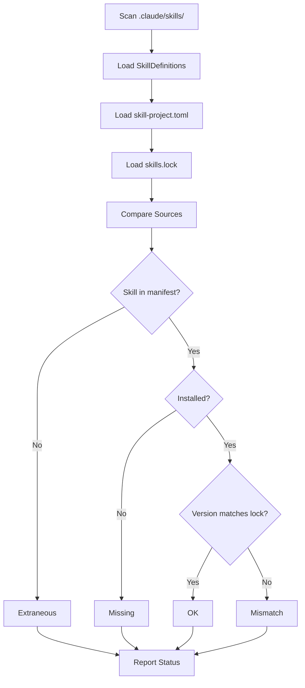

# Skill Reconciliation System

FastSkill 0.9.229

Source: https://docs.gofastskill.com/skill-management/reconciliation

Release revision: 68975dfaca15508bc5cf2fb761d6218405c954ea

Documentation revision: 68975dfaca15508bc5cf2fb761d6218405c954ea


## Overview

FastSkill compares three views of an environment:

1. **Installed Skills** - Skills actually present in `.claude/skills/`
2. **Project Manifest** - Skills declared in `skill-project.toml`
3. **Lockfile** - Exact versions pinned in `skills.lock`

The comparison includes canonical identity, desired constraints, locked origin and revision,
content digest, dependency edges, groups, and every direct, transitive, bundle, or override owner.
An installed directory alone does not prove that the environment matches its desired state.

## Reconciliation States

When you run `fastskill skill list`, each skill is assigned a reconciliation status:

| Status         | Description                                                                               | Action Required                                                      |
| -------------- | ----------------------------------------------------------------------------------------- | -------------------------------------------------------------------- |
| `ok`           | Required identity, constraint, locked facts, contents, and ownership agree                | None                                                                 |
| `missing`      | A selected root or required dependency is absent                                          | Run `fastskill project install`                                      |
| `extraneous`   | Installed content has no managed owner                                                    | Review it; this alone does not fail `--check`                        |
| `mismatch`     | Desired, locked, or actual version/content differs                                        | Restore with `project install --lock` or deliberately `skill update` |
| `unverifiable` | A required immutable selection lacks integrity evidence                                   | Update explicitly to establish a verified selection                  |
| `mutable`      | An editable local selection is structurally valid but its bytes are intentionally mutable | Review the linked source when needed                                 |
| `conflict`     | Retained owners require incompatible content or constraints                               | Resolve the listed owners before applying changes                    |

### Status Details

#### OK

Skill is in the desired state:

* Present in `.claude/skills/`
* Declared in `skill-project.toml` (if applicable)
* Desired constraint accepts the locked version
* Installed identity, version, and digest match the lock (editable links are reported as mutable)
* Every required owner and dependency edge is present

**Example:**

```bash
$ fastskill skill list
ID               Version  Source              Status
──────────────────────────────────────────────────────────────
web-scraper      1.2.3    git                  ok
data-processor    2.1.0    registry              ok
```

#### Missing

Skill is declared in `skill-project.toml` but not installed:

```bash
$ fastskill skill list
ID               Version  Source              Status
──────────────────────────────────────────────────────────────
web-scraper      1.2.3    git                  missing
data-processor    2.1.0    registry              ok
```

**Resolution:**

```bash
# Install missing skills
fastskill project install
```

#### Extraneous

Skill is installed but not declared in `skill-project.toml`:

```bash
$ fastskill skill list
ID               Version  Source              Status
──────────────────────────────────────────────────────────────
web-scraper      1.2.3    git                  ok
data-processor    2.1.0    registry              ok
old-skill        0.1.0    local                extraneous
```

**Resolution options:**

```bash
# Option 1: Remove extraneous skill
fastskill skill remove old-skill

# Option 2: Add to skill-project.toml
# Edit skill-project.toml and add:
# [dependencies]
# old-skill = { origin = { type = "local", path = "./old-skill" } }
```

#### Mismatch

Installed version differs from `skills.lock`:

```bash
$ fastskill skill list
ID               Version  Source              Status
──────────────────────────────────────────────────────────────
web-scraper      1.2.3    git                  ok
data-processor    2.2.0    registry              mismatch (lock: 2.1.0)
```

Version mismatches indicate manual changes or corruption. Resolve to ensure reproducibility.


**Resolution:**

```bash
# Option 1: Reinstall from lockfile (reproducible)
fastskill project install --lock

# Option 2: Update to latest and update lock
fastskill skill update
```

## Reconciliation Process

The `skill list` command performs reconciliation in this order:



## Use Cases

### Development Workflow

```bash
# 1. Add skills to manifest
# Edit skill-project.toml:
# [dependencies]
# new-skill = { origin = { type = "git", url = "https://github.com/user/new-skill.git" } }

# 2. Install skills
fastskill project install

# 3. Check reconciliation
fastskill skill list
# Output: new-skill shows as "ok"

# 4. Install with lock for reproducibility
fastskill project install --lock
```

### Team Collaboration

```bash
# Team member A: Add skill and install
fastskill skill add https://github.com/user/new-skill.git
git add skill-project.toml skills.lock
git commit -m "Add new-skill"

# Team member B: Pull and verify
git pull
fastskill skill list
# Output: All skills should be "ok"

# Team member B: Install with lock
fastskill project install --lock
```

### CI/CD Deployment

```bash
# Restore without network access, then verify the same selected closure
fastskill project install --lock --offline --without dev
fastskill skill list --check --without dev --json > skills-status.json
```

### Troubleshooting Discrepancies

```bash
# 1. Identify issues
fastskill skill list

# 2. Install missing skills
fastskill project install

# 3. Remove extraneous skills
fastskill skill remove old-skill

# 4. Fix version mismatches
fastskill project install --lock

# 5. Verify all are ok
fastskill skill list
```

## Lockfile-Based Reconciliation

When using `skills.lock`, reconciliation focuses on exact version matching:

### Production Deployment

```bash
# Deploy with locked versions
fastskill project install --lock

# Verify reconciliation
fastskill skill list
# Required immutable skills should be "ok"; editable skills are labeled "mutable"
```

### Version Drift Detection

```bash
# Check for version drift
fastskill skill list

# If mismatch found:
# data-processor    2.2.0    registry              mismatch (lock: 2.1.0)

# Resolution depends on intent:
# - If intentional update: update lockfile
# - If accidental corruption: reinstall from lock
```

## Reconciliation JSON Format

The `skill list --format json` output includes detailed reconciliation status:

```json
[
  {
    "id": "web-scraper",
    "version": "1.2.3",
    "description": "Web scraping utilities",
    "source": "git",
    "installed_path": "/home/user/.claude/skills/web-scraper",
    "installed_at": "2026-02-02T12:00:00Z",
    "status": "ok",
    "manifest_version": "1.2.3",
    "lock_version": "1.2.3"
  },
  {
    "id": "data-processor",
    "version": "2.2.0",
    "description": "Data processing tools",
    "source": "registry",
    "installed_path": "/home/user/.claude/skills/data-processor",
    "installed_at": "2026-02-01T10:00:00Z",
    "status": "mismatch",
    "manifest_version": "2.1.0",
    "lock_version": "2.1.0"
  }
]
```

**Field Descriptions:**

* `id`: Skill identifier
* `version`: Installed version (from SkillDefinition)
* `description`: Skill description
* `source`: Source type (git, registry, local, zip)
* `installed_path`: Absolute path to skill directory
* `installed_at`: Installation timestamp (ISO 8601)
* `status`: Reconciliation status (ok, missing, extraneous, mismatch)
* `manifest_version`: Version from `skill-project.toml` (if present)
* `lock_version`: Version from `skills.lock` (if present)

## Reconciliation with Groups

When using dependency groups, reconciliation considers group membership:

```toml skill-project.toml
[dependencies]
prod-skill = { origin = { type = "git", url = "https://github.com/user/prod-skill.git" }, groups = ["prod"] }
dev-tool = { origin = { type = "local", path = "./dev-tool" }, groups = ["dev"] }
```

```bash
# Install production skills only
fastskill project install --without dev

# Check reconciliation
fastskill skill list

# Output:
# prod-skill: ok
# dev-tool: missing (expected, excluded by --without dev)
```

Missing status is expected for skills excluded by group filters. Only report as issues if all skills should be installed.


## Best Practices

### Commit both manifest and lockfile

Always commit `skill-project.toml` and `skills.lock` together to version control. This ensures team members can reproduce exact installations.


### Run fastskill skill list after changes

Run `fastskill skill list` after installing, updating, or removing skills to verify reconciliation status.


### Use --lock for production

Always use `fastskill project install --lock` for production deployments to ensure exact version reproducibility.


### Investigate mismatches promptly

Version mismatches indicate manual changes or corruption. Investigate and resolve promptly to maintain consistency.


### Remove extraneous skills

Remove or add extraneous skills to `skill-project.toml` to avoid confusion and ensure clean skill ecosystem.


## Common Reconciliation Issues

### Scenario: Manual Skill Installation

```bash
# Manual: Add skill outside fastskill
cp -r /path/to/skill ~/.claude/skills/manual-skill

# Check reconciliation
fastskill skill list

# Output:
# manual-skill: extraneous (not in manifest)

# Resolution: Add to manifest or remove
```

### Scenario: Version Mismatch After Update

```bash
# Update skill manually
cd ~/.claude/skills/web-scraper
git pull origin main

# Check reconciliation
fastskill skill list

# Output:
# web-scraper: mismatch (lock: 1.2.3, installed: 1.3.0)

# Resolution: Update lockfile or reinstall from lock
fastskill project install --lock
```

### Scenario: Missing Skills After Clone

```bash
# Clone repository without skills.lock
git clone repo
cd repo

# Check reconciliation
fastskill skill list

# Output:
# web-scraper: missing (skills.lock not found)

# Resolution: Install skills
fastskill project install
```

## Reconciliation in Automation

### CI/CD Health Check

```yaml
# .github/workflows/health-check.yml
name: Skill Health Check
on: [push, pull_request]

jobs:
  check-reconciliation:
    runs-on: ubuntu-latest
    steps:
      - uses: actions/checkout@v3

      - name: Install FastSkill
        run: |
          curl -fsSL https://raw.githubusercontent.com/gofastskill/fastskill/main/scripts/install.sh | bash

      - name: Check reconciliation status
        run: |
          fastskill skill list --format json > skills-status.json

      - name: Verify no reconciliation issues
        run: |
          issues=$(jq '[.[] | select(.status != "ok")] | length' skills-status.json)
          if [ "$issues" -gt 0 ]; then
            echo "Found $issues reconciliation issues:"
            jq '[.[] | select(.status != "ok")]' skills-status.json
            exit 1
          fi
          echo "All skills reconciled successfully"
```

### Automated Reconciliation Report

```bash
#!/bin/bash
# reconcile.sh - Generate reconciliation report

echo "=== FastSkill Reconciliation Report ==="
echo "Generated: $(date)"
echo ""

# Get reconciliation status
fastskill skill list --format json > /tmp/skills-status.json

# Count by status
ok_count=$(jq '[.[] | select(.status == "ok")] | length' /tmp/skills-status.json)
missing_count=$(jq '[.[] | select(.status == "missing")] | length' /tmp/skills-status.json)
extraneous_count=$(jq '[.[] | select(.status == "extraneous")] | length' /tmp/skills-status.json)
mismatch_count=$(jq '[.[] | select(.status == "mismatch")] | length' /tmp/skills-status.json)

echo "Summary:"
echo "  OK: $ok_count"
echo "  Missing: $missing_count"
echo "  Extraneous: $extraneous_count"
echo "  Mismatch: $mismatch_count"
echo ""

# Show details if issues exist
if [ $((missing_count + extraneous_count + mismatch_count)) -gt 0 ]; then
  echo "Issues Found:"
  jq '[.[] | select(.status != "ok") | .id + ": " + .status]' /tmp/skills-status.json
  exit 1
fi

echo "✓ All skills reconciled"
exit 0
```

## Troubleshooting

**All skills show as missing**

**Skills directory incorrect**: Check that `skills_directory` under `[tool.fastskill]` in `skill-project.toml` points to correct location.


**skill-project.toml missing**: Create `skill-project.toml` or use `fastskill project init`.


**Resolution**: Run `fastskill project install` to install skills from manifest.


**Extraneous skills accumulate**

**Manual installations**: Skills may have been added outside FastSkill management.


**Resolution**: Add to `skill-project.toml` if intentional, or remove with `fastskill skill remove`.


**Prevention**: Always use `fastskill skill add` to install skills for proper tracking.


**Persistent version mismatches**

**Manual file changes**: Skills may have been updated manually (e.g., git pull).


**Corrupted lockfile**: Lockfile may be out of sync with actual state.


**Resolution**: Run `fastskill project install --lock` to reinstall from lockfile, or `fastskill skill update` to update lockfile.


## See Also

* [Install Command](/cli-reference/install-command) - Install skills from manifest
* [Update Command](/cli-reference/update-command) - Update skills and lockfile
* [List Command](/cli-reference/skill-commands#fastskill-skill-list) - List skills with reconciliation status
* [Manifest System](/skill-management/manifest-system) - Understanding skill-project.toml and skills.lock
* [`project init`](/configuration/init-command) - Project initialization and setup

