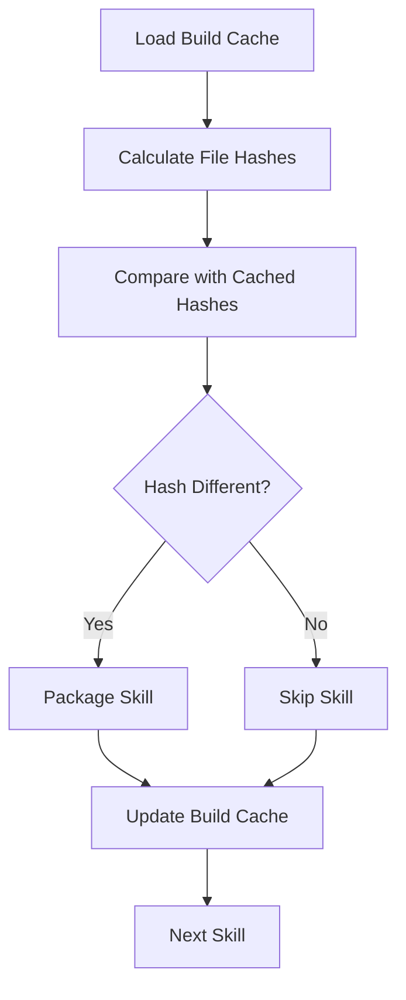
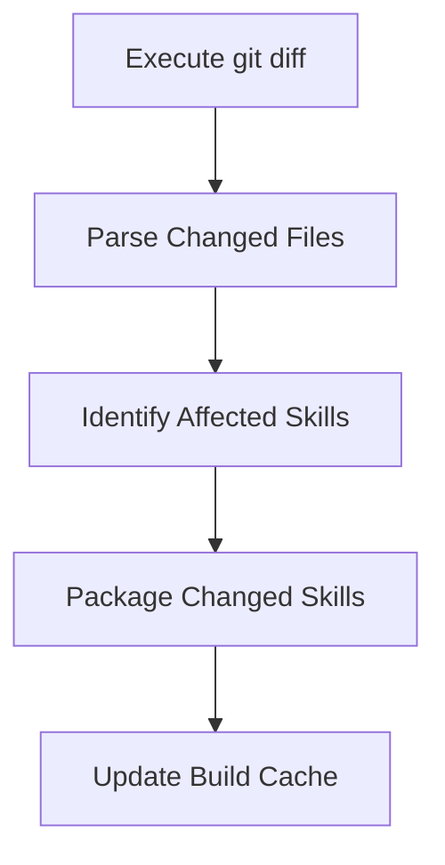

## Overview

FastSkill implements two complementary systems for efficient skill management:

1. **Change Detection** - Identifies which skills have changed since last build
2. **Build Cache** - Tracks skill versions, file hashes, and artifact locations

These systems enable fastskill to:
- Only rebuild changed skills (`--detect-changes`)
- Track version history across builds
- Support reproducible artifact generation
- Integrate with CI/CD pipelines efficiently

<Info>
Build cache and change detection are implemented in `src/core/build_cache.rs` and used by the `package` command.
</Info>

## Change Detection Mechanisms

### Git-based Change Detection

Uses `git diff` to identify changed skill directories between two commits:

```bash
fastskill package --git-diff HEAD~1 HEAD --output ./artifacts
```

**How it works:**
1. Executes `git diff <base> <head>` to get changed files
2. Identifies skill directories containing changed files
3. Only packages skills that have modifications

**Advantages:**
- Fast for large repositories (uses git metadata)
- Well-suited for CI/CD pipelines
- Accurate for repository-based workflows

**Limitations:**
- Requires git repository
- Only detects changes tracked by git (uncommitted changes not detected)
- Limited to comparing specific commit ranges

**Use cases:**
- CI/CD: Package only skills changed in PR
- Release management: Package skills changed since last tag
- Branch comparison: Package skills changed between branches

### File Hash-based Change Detection

Uses SHA256 file hashing to detect changes to skill files:

```bash
fastskill package --detect-changes --output ./artifacts
```

**How it works:**
1. Reads all files in skill directories
2. Calculates SHA256 hash for each file
3. Compares with cached hash from build cache
4. Only packages skills with different hashes

**Hashed Files:**
- `SKILL.md` - Skill definition and documentation
- `skill-project.toml` - Project metadata
- `scripts/*` - Skill scripts and executables
- `references/*` - Reference documentation
- `assets/*` - Asset files (images, templates, etc.)

**Excluded from hashing:**
- Build artifacts (`.zip`, `.tar.gz`)
- Temporary files (`.tmp`, `.bak`)
- Git metadata (`.git/`)
- Build cache (`.fastskill/build-cache.json`)

**Advantages:**
- Works without git repository
- Detects any file change (including uncommitted changes)
- Works with local file systems

**Limitations:**
- Slower for large skill sets (must read all files)
- Requires full filesystem access

**Use cases:**
- Local development: Detect changes to editable skills
- File system-based workflows: No git required
- Testing: Detect changes without version control

**Hash Algorithm:**

```rust
// SHA256 hashing implementation (simplified)
fn calculate_file_hash(file_path: &Path) -> Result<String, Error> {
    let content = std::fs::read(file_path)?;
    let hash = sha256::digest(content.as_bytes());
    Ok(hash)
}
```

**File Hash Structure:**

```json
{
  "skill_id": "web-scraper",
  "file_hash": "a1b2c3d4e5f6...",
  "files_hashed": [
    "SKILL.md",
    "skill-project.toml",
    "scripts/scraper.py",
    "references/api.md",
    "assets/template.html"
  ]
}
```

## Build Cache

### Cache Structure

The build cache is stored in `.fastskill/build-cache.json` and tracks:

```json
{
  "version": "1.0",
  "last_build": "2026-02-02T12:00:00Z",
  "skills": {
    "web-scraper": {
      "version": "1.2.3",
      "previous_version": "1.2.2",
      "hash": "a1b2c3d4e5f6...",
      "last_packaged": "2026-02-02T11:30:00Z",
      "artifact_path": "./artifacts/web-scraper-1.2.3.zip",
      "git_commit": "abc123def456"
    },
    "data-processor": {
      "version": "2.1.0",
      "previous_version": null,
      "hash": "f7e8d9c0a1b2...",
      "last_packaged": "2026-02-02T11:45:00Z",
      "artifact_path": "./artifacts/data-processor-2.1.0.zip",
      "git_commit": null
    }
  }
}
```

### BuildCacheEntry Fields

| Field | Type | Description | Example |
|--------|------|-------------|---------|
| `version` | String | Current version of the skill | `"1.2.3"` |
| `previous_version` | Option\<String\> | Previous version before current build | `null` or `"1.2.2"` |
| `hash` | Option\<String\> | SHA256 hash of all skill files | `"a1b2c3d4e5f6..."` |
| `last_packaged` | Option\<String\> | ISO 8601 timestamp of last packaging | `"2026-02-02T11:30:00Z"` |
| `artifact_path` | Option\<String\> | Path to generated artifact | `"./artifacts/skill-1.2.3.zip"` |
| `git_commit` | Option\<String\> | Git commit hash if available | `"abc123def456"` |

## Change Detection Integration

### Comparing Hashes

The `package` command compares current file hashes with cached hashes:

```rust
use fastskill::core::build_cache::BuildCache;

// Load existing cache
let cache = BuildCache::load(&cache_path)?;

// Calculate current hash
let current_hash = calculate_file_hash(&skill_dir)?;

// Get cached hash
let cached_hash = cache.get_cached_hash(&skill_id);

if cached_hash.as_ref() == Some(&current_hash) {
    println!("Skill {} unchanged, skipping...", skill_id);
} else {
    println!("Skill {} changed, packaging...", skill_id);
    // Package the skill...
    // Update cache
    cache.update_skill(&skill_id, &version, &current_hash, &artifact_path, git_commit);
}
```

### Git Diff Parsing

Git diff provides list of changed files:

```bash
# Example git diff output
$ git diff --name-only HEAD~1 HEAD
skills/web-scraper/SKILL.md
skills/web-scraper/scripts/scraper.py
skills/data-processor/README.md
```

**Parsed changes:**

```rust
fn parse_git_diff(base: &str, head: &str) -> Vec<String> {
    // Execute git diff
    let output = Command::new("git")
        .args(["diff", "--name-only", base, head])
        .output()?;

    // Parse skill directories from changed files
    let changed_files = String::from_utf8(output.stdout)?;
    let skills: Vec<String> = changed_files
        .lines()
        .filter_map(|line| {
            // Extract skill ID from file path
            line.split('/')
                .next() // First component is skill ID
        })
        .collect();

    skills.drain(..).dedup()
}
```

## Package Command Integration

The `package` command uses both systems:

### Detect Changes Mode

```bash
# File hash-based change detection
fastskill package --detect-changes --output ./artifacts
```

**Workflow:**


### Git Diff Mode

```bash
# Git-based change detection
fastskill package --git-diff HEAD~1 HEAD --output ./artifacts
```

**Workflow:**


### Force Mode

Bypass change detection entirely:

```bash
# Package all skills regardless of changes
fastskill package --force --output ./artifacts
```

<Warning>
`--force` repackages all skills, ignoring build cache. Use this when you want to ensure clean builds.
</Warning>

## Cache Updates

### Updating Skill Entries

After successful packaging, the build cache is updated:

```rust
use fastskill::core::build_cache::{BuildCache, SkillCacheEntry};
use chrono::Utc;

let entry = SkillCacheEntry {
    version: "1.2.3".to_string(),
    previous_version: cache.get_cached_version(&skill_id),
    hash: Some(current_hash),
    last_packaged: Some(Utc::now().to_rfc3339()),
    artifact_path: Some("./artifacts/skill-1.2.3.zip".to_string()),
    git_commit: Some(git_commit_hash),
};

cache.update_skill(
    &skill_id,
    &entry.version,
    &entry.hash.as_ref().unwrap(),
    &entry.artifact_path.as_ref().unwrap(),
    git_commit.as_deref(),
);
```

### Saving Cache

Cache is persisted to `.fastskill/build-cache.json`:

```rust
use fastskill::core::build_cache::BuildCache;
use std::path::PathBuf;

let cache_path = PathBuf::from(".fastskill/build-cache.json");
cache.save(&cache_path)?;
```

**Example saved cache:**

```json
{
  "version": "1.0",
  "last_build": "2026-02-02T12:00:00Z",
  "skills": {
    "web-scraper": {
      "version": "1.2.3",
      "previous_version": "1.2.2",
      "hash": "a1b2c3d4e5f6...",
      "last_packaged": "2026-02-02T11:30:00Z",
      "artifact_path": "./artifacts/web-scraper-1.2.3.zip",
      "git_commit": "abc123def456"
    }
  }
}
```

## Build Cache API

### Loading Cache

```rust
use fastskill::core::build_cache::BuildCache;
use std::path::PathBuf;

let cache_path = PathBuf::from(".fastskill/build-cache.json");
let cache = BuildCache::load(&cache_path)?;
```

### Getting Cached Data

```rust
// Get cached version
if let Some(version) = cache.get_cached_version("web-scraper") {
    println!("Cached version: {}", version);
}

// Get cached hash
if let Some(hash) = cache.get_cached_hash("web-scraper") {
    println!("Cached hash: {}", hash);
}

// Get skill entry
if let Some(entry) = cache.skills.get("web-scraper") {
    println!("Previous version: {:?}", entry.previous_version);
    println!("Artifact path: {:?}", entry.artifact_path);
}
```

### Updating Cache

```rust
use fastskill::core::build_cache::BuildCache;

let mut cache = BuildCache::load(&cache_path)?;

cache.update_skill(
    "web-scraper",
    "1.2.3",
    "a1b2c3d4e5f6...",
    "./artifacts/web-scraper-1.2.3.zip",
    Some("abc123def456"),
);
```

### Saving Cache

```rust
cache.save(&cache_path)?;
```

## Use Cases

### CI/CD Pipelines

```yaml
# .github/workflows/package.yml
name: Package Skills
on: [push, pull_request]

jobs:
  package:
    runs-on: ubuntu-latest
    steps:
      - uses: actions/checkout@v3

      - name: Install FastSkill
        run: |
          cargo install fastskill --features git-support

      - name: Package Changed Skills
        # Git-based change detection for PR
        run: |
          fastskill package \
            --git-diff origin/main HEAD \
            --output ./artifacts \
            --bump patch

      - name: Upload Artifacts
        uses: actions/upload-artifact@v3
        with:
          name: skill-packages
          path: ./artifacts
```

### Local Development

```bash
# File hash-based change detection for dev
fastskill package --detect-changes --output ./artifacts

# Only changed skills are packaged
# New file hashes are stored in build cache
```

### Release Management

```bash
# Package skills changed since last release
fastskill package \
  --git-diff v1.0.0 v2.0.0 \
  --output ./artifacts \
  --bump major

# Build cache tracks versions between releases
```

## Performance Considerations

### Git vs Hash-Based Detection

| Factor | Git-Based | Hash-Based |
|--------|-----------|-------------|
| **Speed** | Fast (metadata only) | Slower (reads all files) |
| **Accuracy** | Repository-tracked changes only | All file changes |
| **Dependencies** | Requires git | Filesystem only |
| **Best For** | CI/CD, large repos | Local dev, no-git workflows |

### Hashing Performance

Large skill directories with many files may be slow to hash:

**Optimization strategies:**
1. **Parallel hashing**: Hash multiple files concurrently
2. **Selective hashing**: Only hash changed files first, then verify
3. **Cache hashes**: Cache file hashes per file to speed up subsequent runs

**Example optimization:**

```rust
use rayon::prelude::*;
use sha2::{Digest, Sha256};

fn hash_directory_concurrent(dir: &Path) -> String {
    let files = std::fs::read_dir(dir).unwrap();
    
    files
        .par_iter() // Parallel hashing
        .filter_map(|entry| entry.ok())
        .map(|entry| {
            let path = entry.path();
            let content = std::fs::read(&path).unwrap();
            let hash = Sha256::digest(&content.as_bytes());
            (path, hash)
        })
        .collect()
}
```

## Troubleshooting

<AccordionGroup>
<Accordion title="Build cache corruption">
  <Warning>
  **Cache parse error**: Build cache file is corrupted or invalid JSON.
  </Warning>

  <Tip>
  **Resolution**: Delete `.fastskill/build-cache.json` and rebuild cache from scratch.
  ```bash
  rm .fastskill/build-cache.json
  fastskill package --force
  ```
  </Tip>
</Accordion>

<Accordion title="Hash mismatch errors">
  <Info>
  **Hash calculation inconsistent**: Different runs produce different hashes for same files.
  </Info>

  <Tip>
  **Resolution**: Check for:
  - File system timestamp issues
  - Line ending differences (CRLF vs LF)
  - Hidden files or metadata changes
  - Temporary files included in hashing
  </Tip>
</Accordion>

<Accordion title="Git diff not detecting changes">
  <Warning>
  **Git not in expected state**: Wrong branch or missing commits.
  </Warning>

  <Tip>
  **Resolution**: Verify git state:
  ```bash
  git branch --show-current
  git log --oneline -5
  ```
  </Tip>
</Accordion>

<Accordion title="Change detection not working">
  <Warning>
  **Skills always packaged**: Change detection not filtering unchanged skills.
  </Warning>

  <Tip>
  **Resolution**: Check build cache:
  ```bash
  cat .fastskill/build-cache.json
  # Verify hashes are being compared correctly
  ```
  </Tip>

  <Tip>
  **Resolution**: Verify file hash calculation matches expected algorithm.
  </Tip>
</Accordion>
</AccordionGroup>

## Best Practices

<Steps>
<Step title="Use appropriate change detection">
  Choose git-based detection for CI/CD and hash-based for local development.
</Step>

<Step title="Commit build cache">
  Commit `.fastskill/build-cache.json` to version control for reproducible builds.
</Step>

<Step title="Use --detect-changes for incremental builds">
  Only rebuild changed skills to save time and resources.
</Step>

<Step title="Force rebuilds when needed">
  Use `--force` when you want clean builds or suspect cache corruption.
</Step>

<Step title="Monitor build cache size">
  Large caches can slow down operations. Periodically clean old entries.
</Step>

<Step title="Version bumping after changes">
  Use `--bump` or `--auto-bump` to update versions after packaging changed skills.
</Step>

<Step title="Verify hashes in pipelines">
  Check that file hashing works consistently across different environments.
</Step>
</Steps>

## See Also

- [Package Command](/cli-reference/package-command) - Packaging skills with change detection
- [Version Management](/skill-management/manifest-system) - Version bumping and semver
- [Event System](/advanced-topics/event-system) - Skill lifecycle events and cache invalidation
- [Testing Framework](/testing/framework) - Testing skill packages and changes
