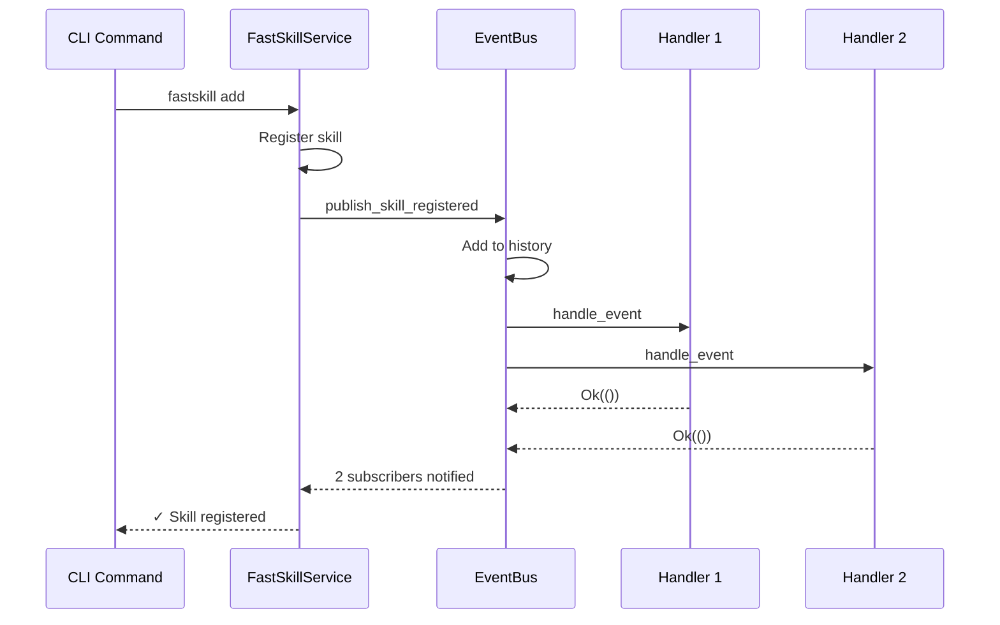

## Overview

FastSkill implements an event-driven architecture using a publish-subscribe pattern. The event bus enables decoupled components to react to skill lifecycle changes, facilitating features like hot-reload, cache invalidation, and logging.

<Info>
The event system is defined in `src/events/event_bus.rs` and provides both synchronous and asynchronous event handling capabilities.
</Info>

## Event Types

FastSkill defines the following event types for skill lifecycle operations:

| Event | Description | When Triggered | Source Location |
|--------|-------------|------------------|------------------|
| `SkillRegistered` | A skill was successfully registered | After `fastskill add` completes | `src/cli/commands/add.rs` |
| `SkillUpdated` | A skill's metadata or configuration was updated | After `fastskill update` completes | `src/cli/commands/update.rs` |
| `SkillUnregistered` | A skill was removed from the system | After `fastskill remove` completes | `src/cli/commands/remove.rs` |
| `SkillReloaded` | A skill was reloaded (e.g., after hot-reload) | After file change in hot-reload | `src/events/hot_reload.rs` |
| `SkillEnabled` | A skill was enabled | After `fastskill disable` or `fastskill add` | `src/core/skill_manager.rs` |
| `SkillDisabled` | A skill was disabled | After `fastskill disable` | `src/core/skill_manager.rs` |
| `SkillValidationFailed` | Skill validation failed with errors | During skill registration or update | `src/validation/skill_validator.rs` |
| `HotReloadEnabled` | Hot-reload feature was enabled | On service startup with hot-reload feature | `src/events/hot_reload.rs` |
| `HotReloadDisabled` | Hot-reload feature was disabled | On service shutdown or explicit disable | `src/events/hot_reload.rs` |
| `Custom` | Custom user-defined events | When explicitly published | User code |

## Event Data Structures

### SkillRegistered

```rust
SkillEvent::SkillRegistered {
    skill_id: String,
    skill: Box<SkillDefinition>,
}
```

**Example:**
```json
{
  "skill_id": "web-scraper",
  "skill": {
    "id": "web-scraper",
    "name": "Web Scraper",
    "version": "1.2.3",
    "description": "Web scraping utilities",
    // ... other skill fields
  }
}
```

### SkillUpdated

```rust
SkillEvent::SkillUpdated {
    skill_id: String,
    changes: SkillUpdate,
}
```

**SkillUpdate fields:**
```rust
struct SkillUpdate {
    pub name: Option<String>,
    pub description: Option<String>,
    pub version: Option<String>,
    pub enabled: Option<bool>,
}
```

**Example:**
```json
{
  "skill_id": "web-scraper",
  "changes": {
    "version": "1.2.4",
    "enabled": true
  }
}
```

### SkillReloaded

```rust
SkillEvent::SkillReloaded {
    skill_id: String,
    success: bool,
    error_message: Option<String>,
}
```

**Example:**
```json
{
  "skill_id": "web-scraper",
  "success": true,
  "error_message": null
}
```

**Or on failure:**
```json
{
  "skill_id": "web-scraper",
  "success": false,
  "error_message": "Failed to parse SKILL.md: Invalid YAML"
}
```

### HotReloadEnabled

```rust
SkillEvent::HotReloadEnabled {
    config: HotReloadConfig,
}
```

**HotReloadConfig fields:**
```rust
struct HotReloadConfig {
    pub watch_paths: Vec<String>,
    pub debounce_ms: u64,
    pub auto_reload: bool,
    pub max_concurrent_reloads: usize,
}
```

**Example:**
```json
{
  "config": {
    "watch_paths": ["/home/user/.claude/skills"],
    "debounce_ms": 500,
    "auto_reload": true,
    "max_concurrent_reloads": 5
  }
}
```

## EventBus Architecture

The `EventBus` struct provides the core event distribution mechanism:

### Core Components

```rust
pub struct EventBus {
    /// Broadcast sender for events
    sender: broadcast::Sender<SkillEvent>,

    /// Event handlers registry
    handlers: Arc<RwLock<EventHandlersMap>>,

    /// Event history for debugging
    event_history: Arc<RwLock<Vec<(SkillEvent, std::time::Instant)>>,

    /// Maximum history size
    max_history_size: usize,
}
```

**Key Features:**
- **Broadcast Channel**: Uses Tokio's broadcast channel for fan-out event distribution
- **Handler Registry**: Maps event types to registered handlers
- **Event History**: Stores recent events for debugging (default: 100 events)
- **Thread-Safe**: Uses `Arc<RwLock<>>` for concurrent access

## Event Handler Interface

### EventHandler Trait

Custom event handlers must implement the `EventHandler` trait:

```rust
#[async_trait]
pub trait EventHandler: Send + Sync {
    async fn handle_event(&self, event: SkillEvent) -> Result<(), ServiceError>;
}
```

**Example Implementation:**

```rust
use fastskill::events::{EventHandler, SkillEvent, SkillUpdate};
use fastskill::ServiceError;

pub struct CacheInvalidator;

#[async_trait]
impl EventHandler for CacheInvalidator {
    async fn handle_event(&self, event: SkillEvent) -> Result<(), ServiceError> {
        match event {
            SkillEvent::SkillUpdated { skill_id, changes } => {
                if changes.version.is_some() {
                    self.invalidate_cache(&skill_id).await?;
                }
            }
            _ => {}
        }
        Ok(())
    }
}

impl CacheInvalidator {
    async fn invalidate_cache(&self, skill_id: &str) -> Result<(), ServiceError> {
        // Invalidation logic here
        Ok(())
    }
}
```

## Built-in Event Handlers

### LoggingEventHandler

Logs all events to the console using tracing:

```rust
pub struct LoggingEventHandler;

#[async_trait]
impl EventHandler for LoggingEventHandler {
    async fn handle_event(&self, event: SkillEvent) -> Result<(), ServiceError> {
        match event {
            SkillEvent::SkillRegistered { skill_id, skill } => {
                info!("[OK] Skill registered: {} ({})", skill.name, skill_id);
            }
            SkillEvent::SkillUpdated { skill_id, .. } => {
                info!("Skill updated: {}", skill_id);
            }
            SkillEvent::SkillUnregistered { skill_id } => {
                info!("Skill unregistered: {}", skill_id);
            }
            SkillEvent::SkillReloaded { skill_id, success, error_message } => {
                if success {
                    info!("Skill reloaded successfully: {}", skill_id);
                } else {
                    warn!("[ERROR] Skill reload failed: {} - {:?}", skill_id, error_message);
                }
            }
            SkillEvent::SkillEnabled { skill_id } => {
                info!("[OK] Skill enabled: {}", skill_id);
            }
            SkillEvent::SkillDisabled { skill_id } => {
                info!("Skill disabled: {}", skill_id);
            }
            SkillEvent::SkillValidationFailed { skill_id, errors } => {
                warn!("[ERROR] Skill validation failed: {} - {} errors", skill_id, errors.len());
            }
            SkillEvent::HotReloadEnabled { config } => {
                info!("[INFO] Hot reload enabled for {} paths", config.watch_paths.len());
            }
            SkillEvent::HotReloadDisabled => {
                info!("Hot reload disabled");
            }
            _ => {}
        }
        Ok(())
    }
}
```

### MetricsEventHandler

Tracks event statistics and counts:

```rust
pub struct MetricsEventHandler {
    event_counts: Arc<RwLock<HashMap<String, usize>>>,
}

#[async_trait]
impl EventHandler for MetricsEventHandler {
    async fn handle_event(&self, event: SkillEvent) -> Result<(), ServiceError> {
        let event_type = // ... determine event type string ...

        let mut counts = self.event_counts.write().await;
        *counts.entry(event_type).or_insert(0) += 1;
        Ok(())
    }
}
```

## Publishing Events

### Using Convenience Methods

FastSkill provides convenience methods for publishing common events:

```rust
use fastskill::events::EventBus;
use fastskill::core::skill_manager::SkillDefinition;

// Skill registered
event_bus.publish_skill_registered(
    skill_id: "web-scraper".to_string(),
    skill: skill_definition,
).await?;

// Skill updated
event_bus.publish_skill_updated(
    skill_id: "web-scraper".to_string(),
    changes: SkillUpdate {
        version: Some("1.2.4".to_string()),
        description: None,
        name: None,
        enabled: Some(true),
    },
).await?;

// Skill unregistered
event_bus.publish_skill_unregistered(
    skill_id: "web-scraper".to_string(),
).await?;

// Skill reloaded
event_bus.publish_skill_reloaded(
    skill_id: "web-scraper".to_string(),
    success: true,
    error_message: None,
).await?;

// Skill enabled
event_bus.publish_skill_enabled(
    skill_id: "web-scraper".to_string(),
).await?;

// Skill disabled
event_bus.publish_skill_disabled(
    skill_id: "web-scraper".to_string(),
).await?;
```

### Publishing Custom Events

```rust
use serde_json::json;

// Create custom event
let custom_event = SkillEvent::Custom {
    event_type: "custom:event".to_string(),
    data: json!({
        "key": "value",
        "timestamp": "2026-02-02T12:00:00Z"
    }),
};

// Publish event
event_bus.publish_event(custom_event).await?;
```

## Subscribing to Events

### Basic Subscription

```rust
use fastskill::events::EventBus;

// Create event bus
let event_bus = EventBus::new();

// Subscribe to all events
let mut receiver = event_bus.subscribe();

// Handle events in a task
tokio::spawn(async move {
    while let Ok(event) = receiver.recv().await {
        println!("Received event: {:?}", event);
    }
});
```

### Registering Event Handlers

```rust
use fastskill::events::{EventHandler, LoggingEventHandler, MetricsEventHandler};

// Create event bus
let event_bus = EventBus::new();

// Register logging handler for all events
event_bus.register_handler("logging", LoggingEventHandler::new()).await?;

// Register metrics handler
let metrics_handler = MetricsEventHandler::new();
event_bus.register_handler("metrics", metrics_handler).await?;

// Register custom handler for specific event type
event_bus.register_handler("cache-invalidator", CacheInvalidator::new()).await?;
```

### Event Type Strings

For registering handlers, use these event type strings:

| Event Type | String |
|-------------|---------|
| SkillRegistered | `"skill:registered"` |
| SkillUpdated | `"skill:updated"` |
| SkillUnregistered | `"skill:unregistered"` |
| SkillReloaded | `"skill:reloaded"` |
| SkillValidationFailed | `"skill:validation:failed"` |
| HotReloadEnabled | `"hot-reload:enabled"` |
| HotReloadDisabled | `"hot-reload:disabled"` |
| SkillEnabled | `"skill:enabled"` |
| SkillDisabled | `"skill:disabled"` |

## Event History

The event bus maintains a configurable history of recent events for debugging:

```rust
use fastskill::events::EventBus;

let event_bus = EventBus::new(); // Default max_history_size: 100

// Get event history
let history = event_bus.get_event_history().await;

for (event, timestamp) in history {
    println!("[{}] Event: {:?}", timestamp, event);
}

// Clear history
event_bus.clear_event_history().await;
```

<Info>
Event history is circular and automatically trimmed when it exceeds `max_history_size`. This prevents memory leaks in long-running services.
</Info>

## Use Cases

### Hot-Reload Integration

The event system enables hot-reload by triggering skill reloads when files change:

```rust
use notify::{Watcher, RecursiveMode, watcher};
use fastskill::events::EventBus;

async fn setup_hot_reload(event_bus: &EventBus) -> Result<(), ServiceError> {
    let mut watcher = watcher(
        move |res| {
            match res {
                Ok(event) => {
                    // Publish skill reloaded event on file changes
                    let skill_id = extract_skill_id(&event.path);
                    tokio::spawn({
                        let event_bus = event_bus.clone();
                        async move {
                            event_bus.publish_skill_reloaded(
                                skill_id,
                                success: true,
                                error_message: None,
                            ).await;
                        }
                    });
                }
                Err(e) => {
                    eprintln!("Watch error: {:?}", e);
                }
            }
        },
    )?;

    // Watch skills directory
    watcher.watch(".claude/skills/", RecursiveMode::Recursive)?;

    Ok(())
}
```

### Cache Invalidation

Automatically invalidate caches when skills are updated:

```rust
struct Cache {
    data: HashMap<String, SkillMetadata>,
}

struct CacheInvalidator {
    cache: Arc<RwLock<Cache>>,
}

#[async_trait]
impl EventHandler for CacheInvalidator {
    async fn handle_event(&self, event: SkillEvent) -> Result<(), ServiceError> {
        match event {
            SkillEvent::SkillUpdated { skill_id, .. } |
            SkillEvent::SkillUnregistered { skill_id } |
            SkillEvent::SkillReloaded { skill_id, .. } => {
                let mut cache = self.cache.write().await;
                cache.data.remove(&skill_id);
                println!("Invalidated cache for skill: {}", skill_id);
            }
            _ => {}
        }
        Ok(())
    }
}
```

### Metrics Collection

Track skill lifecycle events for observability:

```rust
struct MetricsCollector {
    event_bus: Arc<EventBus>,
    metrics: Arc<RwLock<HashMap<String, usize>>>,
}

impl MetricsCollector {
    pub async fn start(&self) {
        let metrics_handler = MetricsEventHandler::new();
        self.event_bus.register_handler("metrics", metrics_handler).await?;

        // Periodically report metrics
        let mut interval = tokio::time::interval(Duration::from_secs(60));
        loop {
            interval.tick().await;
            let counts = metrics_handler.get_event_counts().await;
            println!("Event Metrics: {:?}", counts);
        }
    }
}
```

### Event-Driven UI Updates

Update UI components in response to skill changes:

```rust
struct UIUpdater {
    ui_sender: mpsc::Sender<UIMessage>,
}

#[async_trait]
impl EventHandler for UIUpdater {
    async fn handle_event(&self, event: SkillEvent) -> Result<(), ServiceError> {
        let message = match event {
            SkillEvent::SkillRegistered { skill_id, skill } => {
                UIMessage::SkillAdded {
                    id: skill_id,
                    name: skill.name.clone(),
                }
            }
            SkillEvent::SkillUnregistered { skill_id } => {
                UIMessage::SkillRemoved { id: skill_id }
            }
            _ => return Ok(()),
        };

        self.ui_sender.send(message).await?;
        Ok(())
    }
}
```

## Event Flow Diagram



## Configuration

### Buffer Size

The event bus uses a broadcast channel with configurable buffer size:

```rust
// Default: 1000 events
let (sender, _) = broadcast::channel(1000);
```

<Warning>
If event handlers are slow, the buffer may fill up. Monitor using `get_registered_handlers()` to ensure handlers are processing events efficiently.
</Warning>

### History Size

Event history is limited to prevent memory leaks:

```rust
let event_bus = EventBus {
    max_history_size: 100, // Default
    ..Default::default()
};
```

## Debugging

### Inspecting Event History

```rust
let event_bus = EventBus::new();

// Perform operations
// ...

// Inspect event history
let history = event_bus.get_event_history().await;
for (event, timestamp) in history {
    println!("[{}] {:?}", timestamp, event);
}
```

### Monitoring Event Handler Registration

```rust
let handlers = event_bus.get_registered_handlers().await;
for (event_type, count) in handlers {
    println!("Event type '{}': {} handler(s) registered", event_type, count);
}
```

### Logging All Events

The `LoggingEventHandler` provides built-in event logging:

```rust
use fastskill::events::LoggingEventHandler;

let event_bus = EventBus::new();
let logging_handler = LoggingEventHandler::new();
event_bus.register_handler("logging", logging_handler).await?;

// All events are now logged via tracing
```

Enable logging:

```bash
RUST_LOG=fastskill=debug cargo run --bin fastskill -- <command>
```

## Performance Considerations

### Event Handler Efficiency

```rust
#[async_trait]
impl EventHandler for MyHandler {
    async fn handle_event(&self, event: SkillEvent) -> Result<(), ServiceError> {
        // Pattern match early to avoid unnecessary work
        match event {
            SkillEvent::SkillUpdated { skill_id, .. } => {
                // Only process relevant events
                return self.handle_update(skill_id).await;
            }
            _ => return Ok(()),
        }
    }
}
```

### Concurrency

Event handlers are executed concurrently:

```rust
// Multiple handlers can process the same event simultaneously
event_bus.publish_skill_registered(skill_id, skill).await?;

// Handlers run in parallel
// Handler 1: processes event
// Handler 2: processes event (at same time)
```

<Info>
Ensure event handlers are thread-safe using `Send + Sync` bounds and proper synchronization primitives like `Arc<RwLock<>>`.
</Info>

### Error Handling

Event handlers should handle errors gracefully:

```rust
#[async_trait]
impl EventHandler for RobustHandler {
    async fn handle_event(&self, event: SkillEvent) -> Result<(), ServiceError> {
        match self.process_event(event).await {
            Ok(_) => Ok(()),
            Err(e) => {
                // Log but don't fail event bus
                warn!("Handler error: {:?}, continuing...", e);
                Ok(())
            }
        }
    }
}
```

## Troubleshooting

<AccordionGroup>
<Accordion title="Events not being received">
  <Warning>
  **Handler not registered**: Verify you called `register_handler` for your event type.
  </Warning>

  <Tip>
  **Check registration**: Use `get_registered_handlers()` to verify handler registration.
  ```rust
  let handlers = event_bus.get_registered_handlers().await;
  println!("Registered handlers: {:?}", handlers);
  ```
  </Tip>

  <Warning>
  **Wrong event type string**: Ensure event type string matches exactly.
  </Warning>
  <Tip>
  **Valid types**: skill:registered, skill:updated, skill:unregistered, skill:reloaded, skill:validation:failed, hot-reload:enabled, hot-reload:disabled, skill:enabled, skill:disabled
  </Tip>
</Accordion>

<Accordion title="Event history not updating">
  <Info>
  **History limit reached**: Events older than `max_history_size` are dropped.
  </Info>

  <Tip>
  **Increase limit**: Create EventBus with larger history.
  ```rust
  let event_bus = EventBus {
      max_history_size: 1000, // Increased from default 100
      ..Default::default()
  };
  ```
  </Tip>
</Accordion>

<Accordion title="Slow event processing">
  <Warning>
  **Blocking handlers**: Event handlers must be async and return quickly.
  </Warning>

  <Tip>
  **Spawn async tasks**: For long-running operations, spawn tasks instead of blocking.
  ```rust
  async fn handle_event(&self, event: SkillEvent) -> Result<(), ServiceError> {
      // Spawn long-running task
      tokio::spawn(async move {
          // Long operation here
      });
      Ok(())
  }
  ```
  </Tip>
</Accordion>
</AccordionGroup>

## Best Practices

<Steps>
<Step title="Use specific event handlers">
  Register handlers for specific event types rather than catching all events. This improves performance and maintainability.
</Step>

<Step title="Handle errors gracefully">
  Event handlers should return errors for logging but not crash the event bus. Use non-panicking error handling.
</Step>

<Step title="Keep handlers lightweight">
  Event handlers should be fast. Offload heavy work to async tasks spawned from the handler.
</Step>

<Step title="Use event history for debugging">
  Query `get_event_history()` when investigating issues. Event history provides a chronological log of all events.
</Step>

<Step title="Clean up handlers">
  Unregister handlers when they're no longer needed to prevent memory leaks.
</Step>

<Step title="Test event flows">
  Write tests that publish events and verify handlers receive them correctly. Use the event bus in tests.
</Step>
</Steps>

## See Also

- [Hot Reload](/skill-management/hot-reloading) - File watching and automatic skill reloading
- [Skill Lifecycle](/skill-management/lifecycle) - Complete skill lifecycle documentation
- [Service API](/api-reference/rust-api) - Rust library API including event bus access
