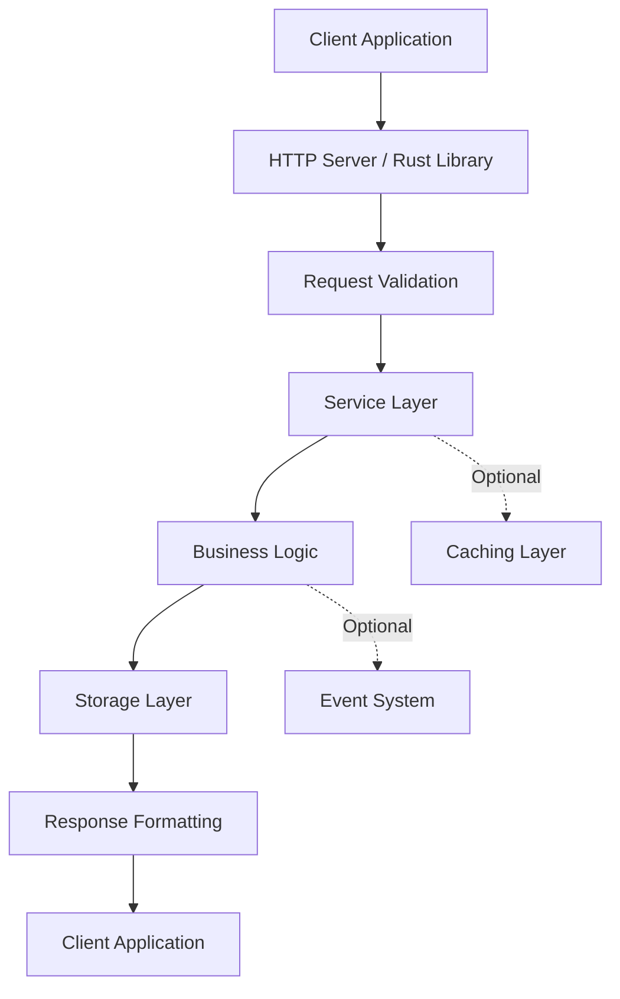

## API Overview

FastSkill provides two main API interfaces:

1. **Rust Library API** - Direct programmatic access for Rust applications
2. **HTTP REST API** - HTTP-based API for web applications and cross-language integration

<Info>
The Rust library provides the core functionality, while the HTTP API exposes it via REST endpoints. Both APIs provide access to the same core functionality.
</Info>

## API Types

### 1. Rust Library API

The primary interface for Rust applications, providing async/await support with tokio and comprehensive error handling.

```rust
use fastskill::{FastSkillService, ServiceConfig};
use std::path::PathBuf;

#[tokio::main]
async fn main() -> Result<(), Box<dyn std::error::Error>> {
    // Create service with configuration
    let config = ServiceConfig {
        skill_storage_path: PathBuf::from("./skills"),
        ..Default::default()
    };

    // Initialize service
    let mut service = FastSkillService::new(config).await?;
    service.initialize().await?;

    // Use the API
    let skills = service.skill_manager().list_skills(None).await?;
    println!("Found {} skills", skills.len());

    service.shutdown().await?;
    Ok(())
}
```

For complete Rust API documentation, see [Rust API Reference](/api-reference/rust-api).

### 2. HTTP REST API

HTTP-based API for web applications, microservices, and cross-language integration. Start the server with:

```bash
fastskill serve --host 0.0.0.0 --port 8080
```

#### Skills Management Endpoints

```bash
# List all skills
curl -X GET http://localhost:8080/api/skills

# Get a specific skill
curl -X GET http://localhost:8080/api/skills/:id

# Create a skill
curl -X POST http://localhost:8080/api/skills \
  -H "Content-Type: application/json" \
  -d '{
    "id": "my-skill",
    "name": "My Skill",
    "description": "Example skill",
    "version": "1.0.0"
  }'

# Update a skill
curl -X PUT http://localhost:8080/api/skills/:id \
  -H "Content-Type: application/json" \
  -d '{...}'

# Delete a skill
curl -X DELETE http://localhost:8080/api/skills/:id
```

#### Search Endpoints

```bash
# Search for skills
curl -X POST http://localhost:8080/api/search \
  -H "Content-Type: application/json" \
  -d '{
    "query": "text processing",
    "limit": 10
  }'
```

#### Reindex Endpoints

```bash
# Reindex all skills
curl -X POST http://localhost:8080/api/reindex

# Reindex a specific skill
curl -X POST http://localhost:8080/api/reindex/:id
```

#### Status Endpoints

```bash
# Get service status
curl -X GET http://localhost:8080/api/status

# Root endpoint
curl -X GET http://localhost:8080/
```

#### Authentication Endpoints

```bash
# Generate JWT token
curl -X POST http://localhost:8080/auth/token \
  -H "Content-Type: application/json" \
  -d '{
    "role": "manager",
    "username": "optional-username"
  }'

# Verify token
curl -X GET http://localhost:8080/auth/verify \
  -H "Authorization: Bearer <token>"
```

#### Claude Code API Endpoints

FastSkill implements the Claude Code v1 API specification:

```bash
# Create skill (Claude API format)
curl -X POST http://localhost:8080/v1/skills \
  -H "Content-Type: application/json" \
  -d '{...}'

# List skills
curl -X GET http://localhost:8080/v1/skills

# Get skill
curl -X GET http://localhost:8080/v1/skills/:skill_id

# Delete skill
curl -X DELETE http://localhost:8080/v1/skills/:skill_id

# Create skill version
curl -X POST http://localhost:8080/v1/skills/:skill_id/versions \
  -H "Content-Type: application/json" \
  -d '{...}'

# List skill versions
curl -X GET http://localhost:8080/v1/skills/:skill_id/versions

# Get skill version
curl -X GET http://localhost:8080/v1/skills/:skill_id/versions/:version

# Delete skill version
curl -X DELETE http://localhost:8080/v1/skills/:skill_id/versions/:version
```

#### Registry Endpoints (when --enable-registry is used)

```bash
# List all sources
curl -X GET http://localhost:8080/api/registry/sources

# List all skills from all sources
curl -X GET http://localhost:8080/api/registry/skills

# List skills from a specific source
curl -X GET http://localhost:8080/api/registry/sources/:name/skills

# Get marketplace.json for a source
curl -X GET http://localhost:8080/api/registry/sources/:name/marketplace

# Refresh all sources
curl -X POST http://localhost:8080/api/registry/refresh

# Publish skill package (requires authentication)
curl -X POST http://localhost:8080/api/registry/publish \
  -H "Content-Type: multipart/form-data" \
  -F "package=@skill-package.zip"

# Get publish job status
curl -X GET http://localhost:8080/api/registry/publish/status/:job_id \
  -H "Authorization: Bearer <token>"
```

#### Manifest Endpoints (when --enable-registry is used)

```bash
# List skills in manifest
curl -X GET http://localhost:8080/api/manifest/skills

# Add skill to manifest
curl -X POST http://localhost:8080/api/manifest/skills \
  -H "Content-Type: application/json" \
  -d '{...}'

# Update skill in manifest
curl -X PUT http://localhost:8080/api/manifest/skills/:id \
  -H "Content-Type: application/json" \
  -d '{...}'

# Remove skill from manifest
curl -X DELETE http://localhost:8080/api/manifest/skills/:id
```

## API Architecture

### Request Flow



### Response Format

All HTTP APIs return consistent JSON response formats:

```json
{
  "success": true,
  "data": {
    // Response data
  }
}
```

Error responses:

```json
{
  "success": false,
  "error": {
    "code": "VALIDATION_ERROR",
    "message": "Invalid skill definition",
    "details": {
      "field": "version",
      "expected": "semantic version string",
      "received": "invalid"
    }
  }
}
```

## Common Patterns

### Error Handling

```rust
use fastskill::ServiceError;

match service.skill_manager().list_skills(None).await {
    Ok(skills) => {
        println!("Found {} skills", skills.len());
    }
    Err(ServiceError::Validation(msg)) => {
        eprintln!("Validation error: {}", msg);
    }
    Err(ServiceError::Storage(msg)) => {
        eprintln!("Storage error: {}", msg);
    }
    Err(e) => {
        eprintln!("Error: {}", e);
    }
}
```

### Filtering Skills

```rust
use fastskill::SkillFilters;

let filters = SkillFilters {
    enabled: Some(true),
    ..Default::default()
};

let skills = service.skill_manager()
    .list_skills(Some(filters))
    .await?;
```

## Starting the HTTP Server

### Basic Server

```bash
# Start server on default port (8080)
fastskill serve

# Custom host and port
fastskill serve --host 0.0.0.0 --port 9000
```

### With Registry UI

```bash
# Enable registry web UI
fastskill serve --enable-registry
```

Then open `http://localhost:8080/` or `http://localhost:8080/dashboard` in your browser.

## Integration Examples

### Rust Application

```rust
use fastskill::{FastSkillService, ServiceConfig};
use std::path::PathBuf;

#[tokio::main]
async fn main() -> Result<(), Box<dyn std::error::Error>> {
    let config = ServiceConfig {
        skill_storage_path: PathBuf::from("./skills"),
        ..Default::default()
    };

    let mut service = FastSkillService::new(config).await?;
    service.initialize().await?;

    // Discover skills
    let skills = service.metadata_service()
        .discover_skills("text processing")
        .await?;

    println!("Found {} relevant skills", skills.len());

    service.shutdown().await?;
    Ok(())
}
```

### HTTP Client (cURL)

```bash
# Search for skills
curl -X POST http://localhost:8080/api/search \
  -H "Content-Type: application/json" \
  -d '{"query": "data visualization", "limit": 5}'

# List all skills
curl -X GET http://localhost:8080/api/skills
```

### HTTP Client (Rust reqwest)

```rust
use reqwest;
use serde_json::json;

#[tokio::main]
async fn main() -> Result<(), Box<dyn std::error::Error>> {
    let client = reqwest::Client::new();

    // Search for skills
    let response = client
        .post("http://localhost:8080/api/search")
        .json(&json!({
            "query": "text processing",
            "limit": 10
        }))
        .send()
        .await?;

    let result: serde_json::Value = response.json().await?;
    println!("Search results: {}", result);

    Ok(())
}
```

## Testing APIs

### Unit Testing with Rust Library

```rust
use fastskill::{FastSkillService, ServiceConfig};
use std::path::PathBuf;
use tempfile::TempDir;

#[tokio::test]
async fn test_list_skills() {
    let temp_dir = TempDir::new().unwrap();
    let config = ServiceConfig {
        skill_storage_path: temp_dir.path().to_path_buf(),
        ..Default::default()
    };

    let mut service = FastSkillService::new(config).await.unwrap();
    service.initialize().await.unwrap();

    let skills = service.skill_manager().list_skills(None).await.unwrap();
    assert!(skills.is_empty()); // Should be empty in test environment
}
```

### Integration Testing with HTTP API

```bash
# Test health endpoint
curl -X GET http://localhost:8080/api/status

# Test skills endpoint
curl -X GET http://localhost:8080/api/skills
```

## Performance Considerations

### Rust Library

- Use `Arc` to share service instances across tasks
- Batch operations when possible
- Use async/await for concurrent operations

```rust
use futures::future::join_all;

// Execute multiple operations concurrently
let queries = vec!["text", "data", "file"];
let tasks: Vec<_> = queries.iter()
    .map(|q| service.metadata_service().discover_skills(q))
    .collect();

let results = join_all(tasks).await;
```

### HTTP API

- Use connection pooling for HTTP clients
- Cache responses when appropriate
- Use compression (enabled by default)

## Troubleshooting

<AccordionGroup>
<Accordion title="Connection Issues">
  <Warning>
  **Connection refused**: Ensure the FastSkill HTTP server is running.
  ```bash
  # Check if server is running
  curl http://localhost:8080/api/status
  ```
  </Warning>

  <Warning>
  **Timeout errors**: Check network connectivity and service health. The server may be overloaded.
  </Warning>
</Accordion>

<Accordion title="Authentication Issues">
  <Info>
  **JWT token errors**: Verify your token is valid and not expired. Generate a new token if needed.
  ```bash
  curl -X POST http://localhost:8080/auth/token \
    -H "Content-Type: application/json" \
    -d '{"role": "manager", "username": "optional-username"}'
  ```
  </Info>
</Accordion>
</AccordionGroup>

<Note>
The FastSkill API is designed to be intuitive and consistent. Start with the Rust library for the best development experience, then use the HTTP API for production deployments and cross-language integration.
</Note>
