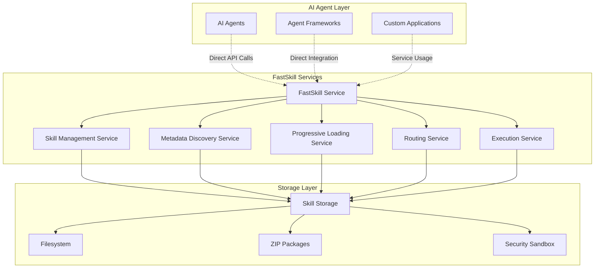

## FastSkill Architecture

FastSkill provides **direct service integration** for AI agents and frameworks. Instead of acting as a tool calling layer, FastSkill offers services that agents can use directly to discover, load, and execute skills.

**The key insight:** FastSkill doesn't try to be a tool calling layer that sits between agents and skills. Instead, it provides a comprehensive service layer that agents integrate with directly to access skill functionality.



**Key Design Principles:**
- **Direct Service Integration**: Agents call FastSkill services directly
- **Progressive Loading**: Load metadata first, content on demand
- **Intelligent Discovery**: Find relevant skills using natural language queries
- **Secure Execution**: Isolated execution environment with resource controls
- **Framework Agnostic**: Works with any AI agent framework

## Service Components

### FastSkillService (Main Service)

The primary interface for AI agents to access skill functionality. Provides unified API for discovery, loading, and execution.

**Key responsibilities:**
- Service lifecycle and configuration
- Direct API access for agents
- Coordination of internal services
- Cross-cutting concerns (logging, metrics)

```rust
let service = FastSkillService::new(config).await?;
service.initialize().await?;

// Access skill management, metadata, and execution services
```

### Skill Manager

The **Skill Manager** handles all CRUD (Create, Read, Update, Delete) operations for skills:

<Expandable title="Core Functions">
  - **Register Skills**: Add new skills to the system with validation
  - **Update Skills**: Modify existing skill definitions and metadata
  - **Delete Skills**: Remove skills and clean up associated resources
  - **Enable/Disable**: Control skill availability without deletion
  - **Version Management**: Track and manage skill versions
  - **Batch Operations**: Efficiently handle multiple skills at once
</Expandable>

### Metadata Service

The **Metadata Service** provides intelligent discovery and filtering capabilities:

<Expandable title="Discovery Methods">
  - **Text Search**: Full-text search across skill descriptions and content
  - **Capability Matching**: Find skills by specific capabilities
  - **Tag-Based Filtering**: Search using skill tags and categories
  - **Fuzzy Matching**: Handle typos and partial matches
  - **Relevance Scoring**: Rank results by relevance and context
</Expandable>

### Progressive Loading Service

The **Progressive Loading Service** implements FastSkill's performance optimization strategy:

<Expandable title="Loading Strategies">
  - **Metadata Only**: Load basic skill information (fast, low memory)
  - **Content on Demand**: Load full skill content when needed
  - **Selective Loading**: Load specific parts of skills based on context
  - **Caching**: Intelligent caching with configurable eviction policies
  - **Memory Management**: Monitor and optimize memory usage
</Expandable>

### Execution Service

The **Execution Service** provides secure execution capabilities that AI agents can use directly:

<Expandable title="Execution Features">
  - **Secure Sandboxing**: Isolated execution environment
  - **Direct API Access**: Agents call execution services directly
  - **Resource Management**: Configurable timeouts and memory limits
  - **Error Handling**: Comprehensive error reporting and recovery
  - **Async Support**: Both synchronous and asynchronous execution
  - **Parameter Validation**: Input validation and type checking
</Expandable>

### Routing Service

The **Routing Service** provides intelligent skill recommendations:

<Expandable title="Routing Intelligence">
  - **Context Analysis**: Understand query intent and context
  - **Multi-Criteria Scoring**: Combine relevance, performance, and compatibility
  - **A/B Testing**: Test different routing algorithms
  - **Feedback Learning**: Improve recommendations based on usage patterns
  - **Fallback Strategies**: Handle edge cases and failures gracefully
</Expandable>

## Progressive Loading

FastSkill efficiently handles large skill ecosystems by loading information in stages:

**Stage 1: Metadata** (Instant)
- Skill ID, name, description, tags, capabilities

**Stage 2: Content** (On Demand)
- Full skill definitions, tools, dependencies

**Stage 3: Execution** (When Needed)
- Runtime preparation, sandbox setup

```rust
// Metadata discovery is instant
let skills = service.metadata_service().discover_skills("text processing").await?;

// Content loaded progressively on demand
let loaded_skills = service.loading_service().load_skills(skill_ids).await?;
        .load_content(&skill_ids)
        .await?;
    
    // Full content now available
    for loaded in loaded_skills {
        println!("Loaded skill: {}", loaded.skill_id);
    }
}
```

## Security Model

FastSkill implements a multi-layered security approach:

### Execution Sandboxing

<Expandable title="Security Layers">
  - **Process Isolation**: Skills run in isolated processes
  - **Resource Limits**: CPU, memory, and time restrictions
  - **Network Controls**: Restricted network access
  - **File System Access**: Limited to skill directories
  - **System Call Filtering**: Prevent dangerous operations
</Expandable>

### Input Validation

<Expandable title="Validation Types">
  - **Schema Validation**: JSON schema for skill definitions
  - **Type Checking**: Runtime type validation for parameters
  - **Content Scanning**: Malicious content detection
  - **Dependency Analysis**: Safe dependency resolution
</Expandable>

## Event System

FastSkill includes a comprehensive event system for monitoring and integration. Events are emitted through the service's event bus and can be subscribed to for monitoring and integration purposes.

<Info>
Events enable integration with monitoring systems, logging platforms, and external dashboards. The event system uses Rust's async channels for efficient event distribution.
</Info>

## Rust Implementation

FastSkill is built with Rust for maximum performance, memory safety, and reliability:

<AccordionGroup>
<Accordion title="Why Rust?">
  FastSkill uses Rust as its core implementation because:

  - **Performance**: Zero-cost abstractions and efficient async runtime
  - **Memory Safety**: Prevents common bugs without runtime overhead
  - **Concurrency**: Excellent async/await support with tokio
  - **Ecosystem**: Rich crate ecosystem for building robust systems
  - **Reliability**: Strong type system and compile-time guarantees
</Accordion>

<Accordion title="Architecture Patterns">
  - **Trait-Based Design**: Services defined as traits for flexibility
  - **Arc-Based Sharing**: Efficient shared ownership with Arc&lt;dyn Trait&gt;
  - **Async/Await**: Full async support with tokio runtime
  - **Error Handling**: Comprehensive error types with thiserror
  - **Storage Abstraction**: Trait-based storage backends
</Accordion>
</AccordionGroup>

## Best Practices

<Steps>
<Step title="Design for Progressive Loading">
  Structure your skills to separate metadata from implementation details. Keep essential information in the metadata for fast discovery.
</Step>

<Step title="Use Descriptive Metadata">
  Provide clear, searchable descriptions, relevant tags, and comprehensive capability lists to improve discoverability.
</Step>

<Step title="Implement Proper Error Handling">
  Design skills with robust error handling and clear error messages to help users understand and resolve issues.
</Step>

<Step title="Monitor Performance">
  Use the built-in metrics and logging to monitor skill performance and identify optimization opportunities.
</Step>

<Step title="Leverage Rust Performance">
  Take advantage of Rust's performance characteristics for high-throughput skill operations and efficient memory usage.
</Step>
</Steps>

<Warning>
Understanding these core concepts is essential for effectively using and extending FastSkill. Take time to experiment with each component to understand how they work together.
</Warning>
