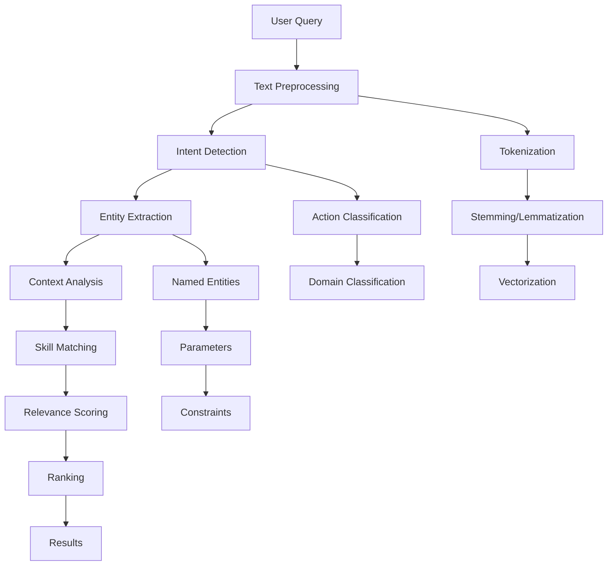

## Overview

Intelligent routing goes beyond basic search to provide sophisticated skill recommendations based on context, historical usage patterns, and relevance scoring. It helps AI agents find the most appropriate skills for their specific tasks.

<Info>
The routing system uses machine learning and heuristic algorithms to understand query intent and match it with the best available skills.
</Info>

## How Routing Works

### Query Analysis

The routing system starts by analyzing the incoming query to understand intent and context:



### Relevance Scoring

The system calculates relevance scores using multiple factors:

```rust
use fastskill::{FastSkillService, ServiceConfig};
use std::path::PathBuf;

#[tokio::main]
async fn main() -> Result<(), Box<dyn std::error::Error>> {
    let config = ServiceConfig {
        skill_storage_path: PathBuf::from("./skills"),
        ..Default::default()
    };

    let mut service = FastSkillService::new(config).await?;
    service.initialize().await?;

    // Use routing service to find relevant skills
    let query = "extract text from PDF and analyze sentiment";
    
    // Get routing recommendations
    let routed_skills = service.routing_service()
        .find_relevant_skills(query)
        .await?;

    println!("🎯 Routing Results:");
    for skill in routed_skills.iter().take(5) {
        println!("   {}: {}", skill.id, skill.name);
        println!("     {}", skill.description);
    }

    service.shutdown().await?;
    Ok(())
}
```

```rust Rust
async fn relevance_scoring_example() -> Result<(), Box<dyn std::error::Error>> {
    let service = FastSkillService::new(config).await?;

    // Get routing recommendations
    let query = "extract text from PDF and analyze sentiment";
    let routed_skills = service.routing_service()
        .find_relevant_skills(query)
        .await?;

    println!("🎯 Routing Results:");
    for skill in routed_skills.iter().take(5) {
        println!("   {}: {:.3}",
                skill.skill_id,
                skill.relevance_score);
        println!("     {}: {}",
                skill.name,
                skill.description);
    }

    Ok(())
}
```
</CodeGroup>

## Routing Configuration

### Routing Settings

Configure the routing system for your specific needs:

```python
from fastskill import RoutingConfig

config = ServiceConfig(
    routing=RoutingConfig(
        # Scoring weights
        text_similarity_weight=0.4,
        capability_match_weight=0.3,
        context_compatibility_weight=0.15,
        performance_weight=0.1,
        recency_weight=0.05,

        # Scoring parameters
        min_relevance_threshold=0.2,      # Minimum score to be considered
        max_results=10,                   # Maximum results to return
        enable_semantic_matching=True,    # Use semantic similarity
        semantic_model="sentence-transformers",  # Semantic model to use

        # Learning parameters
        enable_learning=True,             # Learn from usage patterns
        learning_rate=0.1,                # How quickly to adapt
        feedback_weight=0.2,              # Weight given to user feedback

        # Performance parameters
        enable_caching=True,              # Cache routing results
        cache_ttl_seconds=300,            # Routing cache duration
        enable_parallel_scoring=True,     # Score skills in parallel

        # Fallback parameters
        enable_fallback_routing=True,     # Provide fallback recommendations
        fallback_threshold=0.1,           # Score threshold for fallbacks
        enable_suggestions=True           # Provide "did you mean" suggestions
    )
)
```

## Advanced Routing Features

### Context-Aware Routing

The routing system considers the execution context:

```python
async def context_aware_routing():
    service = FastSkillService()
    await service.initialize()

    # Context-aware query
    contexts = [
        {
            "query": "analyze this data",
            "context": {
                "input_format": "csv",
                "output_format": "chart",
                "data_size": "large",
                "user_expertise": "beginner"
            }
        },
        {
            "query": "analyze this data",
            "context": {
                "input_format": "json",
                "output_format": "report",
                "data_size": "small",
                "user_expertise": "expert"
            }
        }
    ]

    for context in contexts:
        routed_skills = await service.routing_service.find_relevant_skills_with_context(
            context["query"],
            context["context"]
        )

        print(f"🔍 Context: {context['context']}")
        print(f"   Recommendations: {len(routed_skills)} skills")

        for skill in routed_skills[:2]:
            print(f"   - {skill['name']} (score: {skill['relevance_score']:.3f})")

    await service.shutdown()
```

### Multi-Step Routing

For complex tasks requiring multiple skills:

```python
async def multi_step_routing():
    service = FastSkillService()
    await service.initialize()

    # Complex multi-step task
    task = {
        "description": "download website content, extract data, analyze sentiment, generate report",
        "steps": [
            "web_scraping",
            "data_extraction",
            "sentiment_analysis",
            "report_generation"
        ],
        "constraints": {
            "max_execution_time": 300,
            "output_format": "pdf",
            "language": "en"
        }
    }

    # Get skill chain recommendations
    skill_chains = await service.routing_service.find_skill_chains(task)

    print(f"🔗 Found {len(skill_chains)} skill chains:")

    for i, chain in enumerate(skill_chains[:3]):
        print(f"\n   Chain {i+1} (confidence: {chain['confidence']:.3f}):")
        for step, skill in enumerate(chain['skills']):
            print(f"     {step+1}. {skill['name']} ({skill['capability']})")

    await service.shutdown()
```

## Learning and Feedback

### Usage-Based Learning

The routing system learns from usage patterns:

```python
async def learning_routing_example():
    service = FastSkillService()
    await service.initialize()

    # Simulate user feedback
    feedback_data = [
        {
            "query": "extract text from PDF",
            "selected_skill": "pdf-text-extractor",
            "success": True,
            "execution_time": 45,
            "user_rating": 5
        },
        {
            "query": "extract text from PDF",
            "selected_skill": "basic-text-extractor",
            "success": False,
            "error": "PDF format not supported",
            "user_rating": 1
        }
    ]

    # Submit feedback
    for feedback in feedback_data:
        await service.routing_service.submit_feedback(feedback)

    print("✅ Feedback submitted for learning")

    # Get improved recommendations
    query = "extract text from PDF"
    skills_before = await service.routing_service.find_relevant_skills(query)

    # Simulate learning update
    await service.routing_service.update_model()

    skills_after = await service.routing_service.find_relevant_skills(query)

    print(f"📈 Before learning: {skills_before[0]['skill_id']}")
    print(f"📈 After learning: {skills_after[0]['skill_id']}")

    await service.shutdown()
```

### A/B Testing

Test different routing algorithms:

```python
async def ab_testing_routing():
    service = FastSkillService()
    await service.initialize()

    # Configure A/B test
    test_config = {
        "test_name": "routing_algorithm_v2",
        "variants": {
            "control": {"algorithm": "tfidf", "weight": 0.5},
            "variant_a": {"algorithm": "semantic", "weight": 0.3},
            "variant_b": {"algorithm": "hybrid", "weight": 0.2}
        },
        "duration_days": 7,
        "min_samples": 1000
    }

    await service.routing_service.configure_ab_test(test_config)

    # Route queries through A/B test
    query = "analyze customer feedback"
    variant = await service.routing_service.get_ab_variant(query)
    skills = await service.routing_service.route_with_variant(query, variant)

    print(f"🧪 Using variant: {variant}")
    print(f"🎯 Skills: {[s['skill_id'] for s in skills[:3]]}")

    await service.shutdown()
```

## Routing APIs

### REST API

```bash
# Get routing recommendations
curl -X POST http://localhost:8080/api/routing/recommend \
  -H "Content-Type: application/json" \
  -d '{
    "query": "extract text from PDF and analyze sentiment",
    "context": {
      "input_format": "pdf",
      "output_format": "analysis",
      "urgency": "normal"
    },
    "limit": 5
  }'

# Submit feedback
curl -X POST http://localhost:8080/api/routing/feedback \
  -H "Content-Type: application/json" \
  -d '{
    "query": "extract text from PDF",
    "skill_id": "pdf-extractor",
    "success": true,
    "execution_time": 45,
    "user_rating": 5
  }'

# Get routing analytics
curl -X GET http://localhost:8080/api/routing/analytics \
  -H "Content-Type: application/json"
```

### Streaming API

```python
# Real-time routing updates
async def streaming_routing():
    import asyncio
    import json

    # Simulate real-time query stream
    queries = [
        "extract text from documents",
        "analyze data patterns",
        "convert file formats",
        "scrape website content"
    ]

    for query in queries:
        # Get routing recommendation
        routed_skills = await service.routing_service.find_relevant_skills(query)

        # Stream result
        result = {
            "query": query,
            "timestamp": asyncio.get_event_loop().time(),
            "recommendations": [
                {
                    "skill_id": skill["skill_id"],
                    "name": skill["name"],
                    "relevance_score": skill["relevance_score"],
                    "confidence": skill.get("confidence", 0.8)
                }
                for skill in routed_skills[:3]
            ]
        }

        print(f"📡 Streamed: {json.dumps(result)}")
        await asyncio.sleep(1)  # Simulate processing time
```

## Performance Monitoring

### Routing Metrics

Monitor routing system performance:

```python
async def routing_metrics():
    service = FastSkillService()
    await service.initialize()

    # Get routing performance metrics
    metrics = await service.routing_service.get_metrics()

    print("📊 Routing Performance Metrics:")
    print(f"   Total queries processed: {metrics['total_queries']}")
    print(f"   Average response time: {metrics['avg_response_time_ms']:.2f}ms")
    print(f"   Cache hit rate: {metrics['cache_hit_rate']:.1%}")
    print(f"   Average relevance score: {metrics['avg_relevance_score']:.3f}")

    # Query pattern analysis
    patterns = metrics['query_patterns']
    print(f"\n🔍 Query Patterns:")
    for pattern, count in patterns.items():
        print(f"   '{pattern}': {count} queries")

    # Skill performance
    skill_performance = metrics['skill_performance']
    print(f"\n🏆 Top Performing Skills:")
    for skill_id, stats in skill_performance.items():
        print(f"   {skill_id}: {stats['success_rate']:.1%} success, {stats['avg_execution_time']:.2f}s")

    await service.shutdown()
```

### Optimization

Optimize routing performance based on metrics:

```python
async def optimize_routing():
    service = FastSkillService()
    await service.initialize()

    # Analyze current performance
    metrics = await service.routing_service.get_metrics()

    # Identify optimization opportunities
    optimizations = []

    if metrics['avg_response_time_ms'] > 100:
        optimizations.append("Enable caching")
        optimizations.append("Use parallel scoring")

    if metrics['cache_hit_rate'] < 0.5:
        optimizations.append("Increase cache size")
        optimizations.append("Tune cache TTL")

    if metrics['avg_relevance_score'] < 0.7:
        optimizations.append("Improve skill metadata")
        optimizations.append("Add more training data")

    # Apply optimizations
    if "Enable caching" in optimizations:
        await service.routing_service.enable_caching(ttl_seconds=600)

    if "Increase cache size" in optimizations:
        await service.routing_service.update_cache_size(2000)

    print(f"🚀 Applied {len(optimizations)} optimizations")

    await service.shutdown()
```

## Integration Examples

### With AI Agents

```python
class RoutingAgent:
    """AI agent that uses FastSkill routing for tool selection."""

    def __init__(self, service):
        self.service = service
        self.routing_service = service.routing_service

    async def process_request(self, user_query: str, context: dict = None):
        """Process user request using intelligent routing."""

        # Get routing recommendations
        routed_skills = await self.routing_service.find_relevant_skills_with_context(
            user_query, context or {}
        )

        if not routed_skills:
            return {"error": "No suitable skills found"}

        # Select best skill
        best_skill = routed_skills[0]
        skill_id = best_skill['skill_id']

        # Execute skill
        try:
            result = await self.service.tool_service.execute_skill(
                skill_id, extract_parameters(user_query)
            )

            # Submit feedback
            await self.routing_service.submit_feedback({
                "query": user_query,
                "skill_id": skill_id,
                "success": True,
                "execution_time": result.get("execution_time", 0),
                "user_rating": 5
            })

            return result

        except Exception as e:
            # Submit negative feedback
            await self.routing_service.submit_feedback({
                "query": user_query,
                "skill_id": skill_id,
                "success": False,
                "error": str(e),
                "user_rating": 1
            })

            return {"error": f"Skill execution failed: {e}"}
```

### With Agent Frameworks

```python
# Integration with LangChain
from langchain.tools import FastSkillTool
from langchain.agents import initialize_agent

async def langchain_integration():
    service = FastSkillService()
    await service.initialize()

    # Create FastSkill tool
    fastskill_tool = FastSkillTool(
        service=service,
        description="Access to FastSkill ecosystem for various tasks"
    )

    # Initialize agent with routing
    agent = initialize_agent(
        tools=[fastskill_tool],
        llm=your_llm,
        agent_type="conversational-react-description",
        routing_service=service.routing_service  # Enable intelligent routing
    )

    # Agent will automatically use routing for tool selection
    response = await agent.arun("analyze this PDF document and extract key insights")

    await service.shutdown()
    return response
```

## Best Practices

<Steps>
<Step title="Provide rich context">
  Include as much context as possible in your routing queries to get better recommendations.
</Step>

<Step title="Submit feedback">
  Always submit feedback on routing decisions to help the system learn and improve.
</Step>

<Step title="Monitor performance">
  Regularly monitor routing metrics and adjust configuration based on usage patterns.
</Step>

<Step title="Test with variations">
  Test your queries with different phrasings to ensure consistent routing results.
</Step>

<Step title="Balance exploration and exploitation">
  Configure the routing system to balance between recommending familiar skills and exploring new ones.
</Step>
</Steps>

## Troubleshooting

<AccordionGroup>
<Accordion title="Poor Recommendations">
  <Warning>
  **Insufficient metadata**: Ensure skills have comprehensive descriptions, tags, and capabilities.
  ```python
  # Check skill metadata quality
  skills = await service.list_skills()
  for skill in skills[:5]:
      print(f"{skill['name']}: {skill.get('description', 'No description')}")
  ```
  </Warning>

  <Warning>
  **Lack of training data**: The routing system improves with usage. Provide feedback to help it learn.
  ```python
  # Submit feedback for better learning
  await service.routing_service.submit_feedback(feedback_data)
  ```
  </Warning>
</Accordion>

<Accordion title="Slow Performance">
  <Tip>
  **Enable caching**: Use routing result caching to improve response times for similar queries.
  </Tip>

  <Tip>
  **Tune scoring**: Reduce the number of scoring factors or adjust weights for faster computation.
  </Tip>
</Accordion>

<Accordion title="Inconsistent Results">
  <Info>
  **Learning updates**: The routing system learns over time. Results may change as it adapts to usage patterns.
  </Info>

  <Info>
  **Randomization**: Some routing algorithms include controlled randomization to ensure diversity in recommendations.
  </Info>
</Accordion>
</AccordionGroup>

<Note>
Intelligent routing improves over time with usage and feedback. Start with good skill metadata and provide consistent feedback to achieve optimal performance.
</Note>
