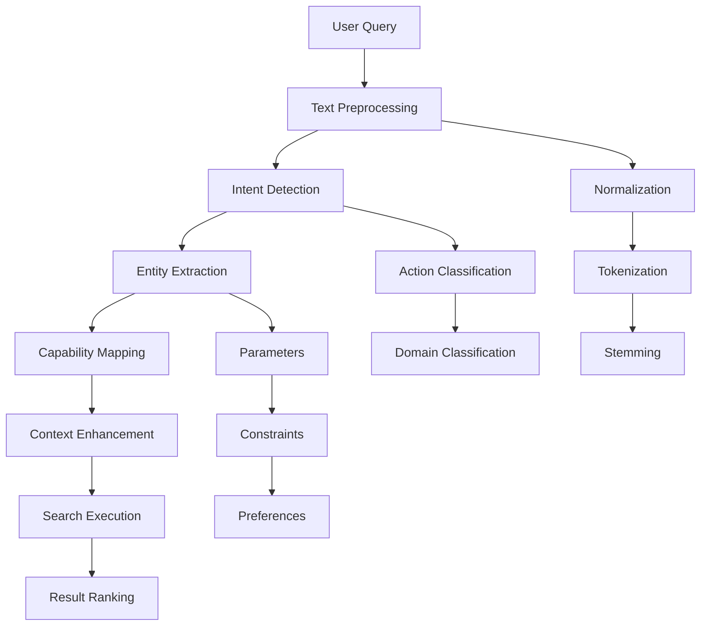

## Overview

Query processing is the foundation of FastSkill's intelligent discovery system. It transforms natural language queries into structured search criteria that can be matched against skill metadata.

<Info>
Effective query processing understands user intent and maps it to available capabilities, making skill discovery intuitive and accurate.
</Info>

## Query Processing Pipeline



## Text Preprocessing

### Query Processing

FastSkill processes queries through the metadata service:

```rust
use fastskill::{FastSkillService, ServiceConfig};
use std::path::PathBuf;

#[tokio::main]
async fn main() -> Result<(), Box<dyn std::error::Error>> {
    let config = ServiceConfig {
        skill_storage_path: PathBuf::from("./skills"),
        ..Default::default()
    };

    let mut service = FastSkillService::new(config).await?;
    service.initialize().await?;

    // Process natural language queries
    let queries = vec![
        "Extract text from PDF documents",
        "Convert DOCX to PDF files",
        "Analyze CSV data and create charts",
    ];

    for query in queries {
        let skills = service.metadata_service()
            .discover_skills(&query)
            .await?;
        
        println!("Query: '{}'", query);
        println!("Found {} matching skills", skills.len());
        for skill in &skills {
            println!("  - {}: {}", skill.id, skill.name);
        }
        println!();
    }

    service.shutdown().await?;
    Ok(())
}
```

### Search Methods

FastSkill provides multiple search methods:
    stop_words = {
        'a', 'an', 'the', 'and', 'or', 'but', 'in', 'on', 'at', 'to', 'for',
        'of', 'with', 'by', 'from', 'as', 'is', 'are', 'was', 'were', 'be',
        'been', 'being', 'have', 'has', 'had', 'do', 'does', 'did', 'will',
        'would', 'could', 'should', 'may', 'might', 'can', 'this', 'that',
        'these', 'those', 'i', 'me', 'my', 'we', 'us', 'our', 'you', 'your'
    }

    # Keep meaningful tokens
    meaningful_tokens = [
        token for token in tokens
        if len(token) > 2 and token not in stop_words
    ]

    return meaningful_tokens

# Example
query = "Extract text from PDF documents and analyze sentiment"
tokens = tokenize_query(query)
print(f"Query: '{query}'")
print(f"Tokens: {tokens}")
```

## Intent Detection

### Action Classification

Identify the primary action the user wants to perform:

```python
def classify_action(tokens: List[str]) -> str:
    """Classify the primary action in a query."""

    action_patterns = {
        'extract': ['extract', 'get', 'pull', 'retrieve', 'obtain'],
        'convert': ['convert', 'transform', 'change', 'translate'],
        'analyze': ['analyze', 'examine', 'study', 'investigate', 'review'],
        'create': ['create', 'make', 'generate', 'build', 'produce'],
        'organize': ['organize', 'sort', 'arrange', 'categorize', 'group'],
        'search': ['search', 'find', 'look', 'locate', 'discover'],
        'validate': ['validate', 'check', 'verify', 'confirm', 'test'],
        'process': ['process', 'handle', 'manage', 'work']
    }

    # Score each action based on token matches
    action_scores = {}
    for action, patterns in action_patterns.items():
        matches = sum(1 for token in tokens if token in patterns)
        if matches > 0:
            action_scores[action] = matches / len(patterns)

    if action_scores:
        return max(action_scores, key=action_scores.get)

    return 'unknown'

# Example usage
test_queries = [
    "Extract text from PDF documents",
    "Convert files to different formats",
    "Analyze data and create charts",
    "Organize my files by type"
]

for query in test_queries:
    tokens = tokenize_query(query)
    action = classify_action(tokens)
    print(f"Query: '{query}'")
    print(f"Action: {action}")
    print()
```

## Entity Extraction

### Parameter Extraction

Extract parameters and constraints from queries:

```python
def extract_parameters(query: str) -> Dict[str, Any]:
    """Extract parameters and constraints from a query."""

    parameters = {}

    # File format patterns
    format_patterns = {
        'pdf': ['pdf', 'adobe', 'portable document'],
        'docx': ['docx', 'word', 'microsoft word'],
        'csv': ['csv', 'comma separated', 'spreadsheet'],
        'json': ['json', 'javascript object'],
        'html': ['html', 'web page', 'markup'],
        'xml': ['xml', 'extensible markup']
    }

    # Extract file formats
    for format_name, patterns in format_patterns.items():
        if any(pattern in query.lower() for pattern in patterns):
            parameters['input_format'] = format_name
            parameters['output_format'] = format_name
            break

    # Extract size constraints
    size_patterns = {
        'large': ['large', 'big', 'many', 'multiple'],
        'small': ['small', 'few', 'single', 'one'],
        'batch': ['batch', 'bulk', 'multiple', 'many files']
    }

    for size, patterns in size_patterns.items():
        if any(pattern in query.lower() for pattern in patterns):
            parameters['batch_size'] = size
            break

    # Extract urgency
    urgency_patterns = {
        'urgent': ['urgent', 'immediate', 'asap', 'quick'],
        'normal': ['normal', 'regular', 'standard'],
        'low': ['low', 'when possible', 'background']
    }

    for urgency, patterns in urgency_patterns.items():
        if any(pattern in query.lower() for pattern in patterns):
            parameters['urgency'] = urgency
            break

    return parameters

# Example
query = "Extract text from large PDF documents urgently"
parameters = extract_parameters(query)
print(f"Query: '{query}'")
print(f"Parameters: {parameters}")
```

## Capability Mapping

### Query to Capability Translation

Map natural language to specific capabilities:

```python
def map_query_to_capabilities(query: str) -> List[str]:
    """Map a natural language query to specific capabilities."""

    query_lower = query.lower()
    capabilities = []

    # Text processing capabilities
    if any(word in query_lower for word in ['extract', 'pull', 'get']):
        if any(word in query_lower for word in ['text', 'content', 'document']):
            capabilities.append('text_extraction')
        if any(word in query_lower for word in ['data', 'information']):
            capabilities.append('data_extraction')

    # Analysis capabilities
    if any(word in query_lower for word in ['analyze', 'examine', 'study']):
        if any(word in query_lower for word in ['sentiment', 'emotion', 'feeling']):
            capabilities.append('sentiment_analysis')
        if any(word in query_lower for word in ['data', 'statistics']):
            capabilities.append('data_analysis')
        if any(word in query_lower for word in ['text', 'content']):
            capabilities.append('text_analysis')

    # Conversion capabilities
    if any(word in query_lower for word in ['convert', 'transform', 'change']):
        if any(word in query_lower for word in ['format', 'type']):
            capabilities.append('format_conversion')
        if any(word in query_lower for word in ['file']):
            capabilities.append('file_conversion')

    # Organization capabilities
    if any(word in query_lower for word in ['organize', 'sort', 'arrange']):
        capabilities.append('file_organization')
        capabilities.append('data_organization')

    # Web capabilities
    if any(word in query_lower for word in ['scrape', 'crawl', 'download']):
        capabilities.append('web_scraping')
    if any(word in query_lower for word in ['api', 'webhook']):
        capabilities.append('api_integration')

    # Return unique capabilities
    return list(set(capabilities))

# Example usage
queries = [
    "Extract text from PDF documents",
    "Analyze sentiment in customer reviews",
    "Convert files to different formats",
    "Organize my files by type",
    "Scrape data from websites"
]

for query in queries:
    capabilities = map_query_to_capabilities(query)
    print(f"Query: '{query}'")
    print(f"Capabilities: {capabilities}")
    print()
```

<Note>
Query processing is the bridge between natural language and structured skill discovery. Good query processing makes FastSkill feel intuitive and intelligent.
</Note>