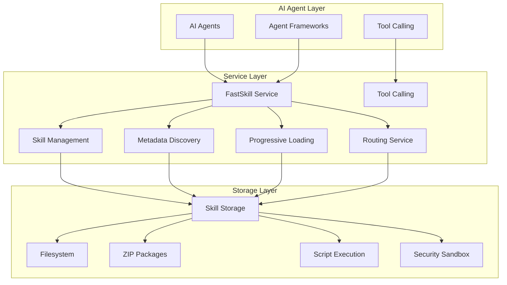

<Note>
**New to FastSkill?** Start with the [Welcome Page](/welcome) to learn about the problems FastSkill solves and how it expands the Claude Code skill standard.
</Note>

<Frame>

</Frame>

## What is FastSkill?

FastSkill is a **high-performance Rust service layer** that enables AI agents and agent frameworks to discover, load, and execute skills directly. It provides comprehensive services that agents integrate with to access skill functionality without requiring a tool calling layer.

<Info>
FastSkill is built with Rust for maximum performance, memory safety, and reliability. The service layer provides async/await support via tokio and can be used as a library or through the CLI.
</Info>

## Key Features

<CardGroup cols={2}>
  <Card title="Semantic Search" icon="search">
    Find skills using OpenAI embeddings for semantic understanding, not just keyword matching.
  </Card>

  <Card title="Cursor Integration" icon="code">
    Automatically generate skill registries for Cursor IDE integration and AI agent tool discovery.
  </Card>

  <Card title="Progressive Loading" icon="zap">
    Load skill metadata first, then content on demand for optimal performance and memory usage.
  </Card>

  <Card title="Keyword Search" icon="file-text">
    Traditional text-based search for reliable, predictable skill discovery.
  </Card>

  <Card title="Multiple Output Formats" icon="table">
    Export results as tables, JSON, or XML for different integration needs.
  </Card>

  <Card title="Local Vector Index" icon="database">
    Store embeddings locally in SQLite for fast, offline semantic search.
  </Card>
</CardGroup>

## Quick Start

Get up and running with FastSkill in under 5 minutes:

```rust
use fastskill::{FastSkillService, ServiceConfig};
use std::path::PathBuf;

#[tokio::main]
async fn main() -> Result<(), Box<dyn std::error::Error>> {
    // Create service with default configuration
    let config = ServiceConfig {
        skill_storage_path: PathBuf::from("./skills"),
        ..Default::default()
    };

    let service = FastSkillService::new(config).await?;
    service.initialize().await?;

    // List available skills
    let skills = service.skill_manager().list_skills(None).await?;
    println!("Found {} skills", skills.len());

    // Discover relevant skills using semantic search
    let relevant_skills = service.metadata_service()
        .discover_skills("extract text from PDF")
        .await?;

    println!("Found {} relevant skills", relevant_skills.len());

    Ok(())
}
```

<Check>
Your FastSkill service is now running! Check out the [Getting Started guide](/quickstart) to learn more.
</Check>

## Architecture Overview

FastSkill follows a modular Rust architecture designed for scalability and performance:



### Core Components

- **CLI Tool**: Rust-based command-line interface for indexing and searching skills
- **Vector Index**: SQLite-based storage for skill embeddings and metadata
- **Embedding Service**: OpenAI integration for semantic text vectorization
- **Search Engine**: Hybrid search supporting both semantic and keyword matching
- **Markdown Export**: Automatic generation of Cursor-compatible skill registries
- **Rust Library**: High-performance API for programmatic skill management with async/await support

## Use Cases

FastSkill is perfect for:

- **AI Agent Development**: Enable agents to discover and use skills through direct service integration
- **Service Integration**: Provide comprehensive services that agents can use directly
- **Skill Marketplaces**: Build platforms where users can share and consume skills
- **Enterprise Integration**: Standardize skill access across different agent frameworks
- **Development Workflows**: Hot reload skills during development without service restart

## Next Steps

<Steps>
<Step title="Install FastSkill">
  Install the Rust CLI and library following the [installation guide](/installation).
</Step>

<Step title="Create your first skill">
  Learn how to define and register skills in the [skill management section](/skill-management/registration).
</Step>

<Step title="Integrate with your agent">
  Connect FastSkill to your AI agent or framework using our [integration tutorials](/examples/integration-tutorials).
</Step>

<Step title="Explore advanced features">
  Dive into [progressive loading](/progressive-loading/strategies) and [intelligent routing](/discovery/intelligent-routing) for optimal performance.
</Step>
</Steps>

<Warning>
FastSkill focuses on skill discovery and search capabilities. For skill execution, read the generated SKILL.md files directly. FastSkill does not provide execution services.
</Warning>

## Getting Help

- 📖 **[Documentation](/welcome)**: Complete guides and reference materials
- 🐛 **[GitHub Issues](https://github.com/gofastskill/fastskill/issues)**: Report bugs and request features

Ready to get started? Jump to the [Quick Start guide](/quickstart) or [installation instructions](/installation).
