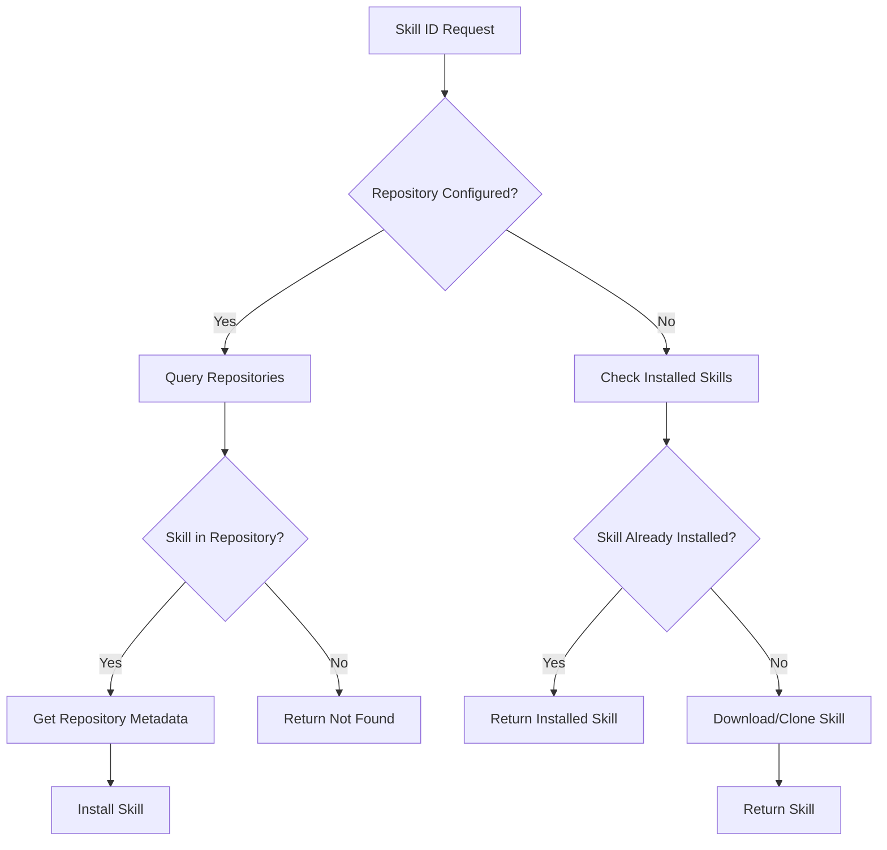

## Overview

FastSkill implements a flexible, multi-source repository system that allows you to discover and install skills from various sources including Git repositories, HTTP registries, ZIP files, and local filesystem paths.

<Info>
Repository configuration is stored in `[tool.fastskill.repositories]` section of `skill-project.toml` or in `.claude/repositories.toml` for backward compatibility.
</Info>

## Repository Types

### Git Marketplace

A Git repository containing a `marketplace.json` file that lists all available skills.

**Configuration:**

```toml skill-project.toml
[[tool.fastskill.repositories]]
name = "team-skills"
type = "git-marketplace"
url = "https://github.com/team/skills.git"
branch = "main"
priority = 0

# Optional authentication
auth_type = "pat"
auth_value = "ghp_xxxxxxxxxxxxxxxxxxxx"

# Optional subdirectory
source_subdir = "skills"
```

**marketplace.json Format:**

```json marketplace.json
{
  "version": "1.0",
  "skills": [
    {
      "id": "web-scraper",
      "name": "Web Scraper",
      "description": "Scrape web content efficiently",
      "version": "1.2.3",
      "author": "FastSkill Team",
      "license": "MIT",
      "tags": ["web", "scraping", "data"],
      "capabilities": ["http_requests", "file_io"],
      "file_path": "web-scraper/SKILL.md"
    },
    {
      "id": "data-processor",
      "name": "Data Processor",
      "description": "Process and analyze data",
      "version": "2.1.0",
      "author": "Data Team",
      "license": "Apache-2.0",
      "tags": ["data", "analysis", "python"],
      "capabilities": ["file_processing", "statistics"],
      "file_path": "data-processor/SKILL.md"
    }
  ]
}
```

**How it works:**
1. Clones Git repository to local cache
2. Parses `marketplace.json` for skill metadata
3. Provides skill search and discovery via FastSkill

**Use cases:**
- Team skill sharing via private Git repository
- Version-controlled skill catalogs
- Multi-skill repositories with metadata
- Custom skill discovery with rich metadata

### HTTP Registry

An HTTP API that provides a flat index of available skills.

**Configuration:**

```toml skill-project.toml
[[tool.fastskill.repositories]]
name = "public-registry"
type = "http-registry"
index_url = "https://registry.fastskill.dev/index"
priority = 0

# Optional authentication
auth_type = "api-key"
auth_value = "registry-api-key-xxxxxxxx"
```

**Registry Index Format:**

```json
{
  "version": "1.0",
  "skills": [
    {
      "id": "pptx",
      "name": "PowerPoint Generator",
      "description": "Create PowerPoint presentations",
      "version": "1.2.3",
      "author": "FastSkill Team",
      "source": "https://registry.fastskill.dev/skills/pptx.zip"
    },
    {
      "id": "json-utils",
      "name": "JSON Utilities",
      "description": "JSON manipulation and validation",
      "version": "2.0.1",
      "source": "https://registry.fastskill.dev/skills/json-utils.zip"
    }
  ]
}
```

**How it works:**
1. Fetches index from HTTP endpoint
2. Provides skill metadata and download URLs
3. Skills downloaded as ZIP files when installed

**Use cases:**
- Public skill registries
- Centralized skill distribution
- Versioned skill releases
- Skill search and discovery at scale

### ZIP URL

A base URL pattern for ZIP file downloads.

**Configuration:**

```toml skill-project.toml
[[tool.fastskill.repositories]]
name = "skill-archive"
type = "zip-url"
base_url = "https://example.com/skills"
priority = 0
```

**Download Pattern:**

Skills are downloaded as: `{base_url}/{skill_id}-{version}.zip`

**Use cases:**
- Simple file servers with ZIP archives
- Static skill hosting
- Minimal infrastructure requirements

### Local

Local filesystem path for skill discovery.

**Configuration:**

```toml skill-project.toml
[[tool.fastskill.repositories]]
name = "local-skills"
type = "local"
path = "./local-skills"
priority = 0
```

**How it works:**
1. Scans local filesystem for `SKILL.md` files
2. Each directory containing `SKILL.md` is treated as a skill
3. Skills installed via filesystem copy or symlinks

**Use cases:**
- Local skill development
- Shared network storage
- Offline skill repositories
- Testing local skills before publishing

## Authentication Types

### PAT (Personal Access Token)

For Git repositories requiring token authentication.

```toml
auth_type = "pat"
auth_value = "ghp_xxxxxxxxxxxxxxxxxxxx"
```

**Use cases:**
- GitHub repositories (classic PAT)
- GitLab repositories
- Generic Git servers with token auth

### SSH Key

Path to SSH private key file.

```toml
auth_type = "ssh-key"
auth_value = "/home/user/.ssh/id_ed25519"
```

**Use cases:**
- GitHub/GitLab repositories with SSH keys
- Automated deployments without interactive auth
- Multi-environment setups

### SSH

SSH connection without key file (uses system SSH agent).

```toml
auth_type = "ssh"
auth_value = "git@github.com:org/skills.git"
```

**Use cases:**
- Systems with SSH agent
- Automated deployments
- Development environments with SSH config

### Basic Auth

Username and password authentication.

```toml
auth_type = "basic"
auth_value = "username:password"
```

<Warning>
Basic auth stores credentials in plain text. Use only for test environments or secure configuration management.
</Warning>

**Use cases:**
- Simple HTTP registries
- Development and testing
- Internal tool registries

### API Key

API key for HTTP registry access.

```toml
auth_type = "api-key"
auth_value = "registry-api-key-xxxxxxxx"
```

**Use cases:**
- Public HTTP registries with access control
- Rate limiting and usage tracking
- Commercial skill marketplaces

## Priority-Based Conflict Resolution

When a skill ID is available from multiple repositories, priority determines which repository is used:

**Priority Rules:**
- Lower priority numbers are checked first
- Default priority: `0`
- Higher priority values are checked later
- First match wins (short-circuit)

**Example:**

```toml skill-project.toml
[[tool.fastskill.repositories]]
name = "public-registry"
type = "http-registry"
index_url = "https://registry.fastskill.dev/index"
priority = 0  # Highest priority

[[tool.fastskill.repositories]]
name = "team-skills"
type = "git-marketplace"
url = "https://github.com/team/skills.git"
priority = 1  # Lower priority

[[tool.fastskill.repositories]]
name = "experimental"
type = "http-registry"
index_url = "https://experimental.fastskill.dev/index"
priority = 2  # Lowest priority
```

**Resolution flow for skill "web-scraper":**
1. Check `public-registry` (priority 0) → Found! → Use this one
2. If not found, check `team-skills` (priority 1) → Continue searching
3. If not found, check `experimental` (priority 2) → Continue searching
4. Return error if skill not found in any repository

## Skill Resolution Process

The skill resolution workflow:



**Detailed steps:**
1. **Parse dependency specification** - Extract skill ID from `skill-project.toml` [dependencies]
2. **Query repositories** - Check all configured repositories in priority order
3. **Search for skill** - Look for skill in each repository
4. **Check installed** - Verify if skill is already installed in `.claude/skills/`
5. **Download if needed** - Clone/fetch skill from repository if not installed
6. **Install** - Register skill in FastSkill storage
7. **Update lockfile** - Record exact version in `skills.lock`

## Repository Configuration

### skill-project.toml (Recommended)

Project-level configuration with repository definitions:

```toml skill-project.toml
[dependencies]
web-scraper = { source = "registry", id = "pptx" }
data-processor = { source = "git", url = "https://github.com/team/data-tools.git" }

[tool.fastskill.repositories]
[[tool.fastskill.repositories]]
name = "public-registry"
type = "http-registry"
index_url = "https://registry.fastskill.dev/index"
priority = 0

[[tool.fastskill.repositories]]
name = "team-skills"
type = "git-marketplace"
url = "https://github.com/team/skills.git"
branch = "develop"
priority = 1
```

**Advantages:**
- Single file with project configuration
- Repository and dependencies together
- Version control of entire project setup
- Easy to share and maintain

### .claude/repositories.toml (Legacy)

Backward-compatible configuration file:

```toml
[[repositories]]
name = "public-registry"
type = "http-registry"
index_url = "https://registry.fastskill.dev/index"
priority = 0
```

**Note:** This format is supported for backward compatibility but `skill-project.toml` is preferred.

## CLI Commands for Repository Management

### fastskill sources

Primary command for repository management:

```bash
# List all repositories
fastskill sources list

# Add new repository
fastskill sources add team-tools --type git-marketplace \
  --url https://github.com/team/skills.git \
  --priority 1

# Remove repository
fastskill sources remove team-tools

# Show repository details
fastskill sources show team-tools

# Update repository
fastskill sources update team-tools --priority 0

# Test repository connectivity
fastskill sources test team-tools

# Refresh repository cache
fastskill sources refresh

# Create marketplace.json from directory
fastskill sources create ./skills --output marketplace.json
```

### fastskill registry

Legacy alias for repository management (same functionality):

```bash
# Add repository (legacy)
fastskill registry add team-tools --repo-type git-marketplace \
  https://github.com/team/skills.git

# List skills from repository
fastskill registry list-skills

# Show skill from repository
fastskill registry show-skill pptx
```

## Repository Authentication Examples

### GitHub with PAT

```bash
# Set up GitHub PAT repository
fastskill sources add github-skills \
  --type git-marketplace \
  --url https://github.com/user/skills.git \
  --auth-type pat \
  --auth-value ghp_xxxxxxxxxxxxxxxxxxxx
```

### Private Registry with API Key

```bash
# Configure private registry
fastskill sources add private-registry \
  --type http-registry \
  --url https://private.example.com/index \
  --auth-type api-key \
  --auth-value sk_live_xxxxxxxxxxxxxxxxxxxx
```

### Git with SSH

```bash
# Set up SSH key repository
fastskill sources add gitlab-skills \
  --type git-marketplace \
  --url git@gitlab.com:team/skills.git \
  --auth-type ssh-key \
  --auth-value /home/user/.ssh/id_ed25519
```

## Skill Discovery and Installation

### From Registry ID

```toml skill-project.toml
[dependencies]
web-scraper = { source = "registry", id = "pptx" }
```

```bash
# Install skill from registry ID
fastskill install
# Resolves to public-registry and downloads pptx
```

### From Git Repository

```toml skill-project.toml
[dependencies]
data-tools = { source = "git", url = "https://github.com/org/data-tools.git" }
```

```bash
# Install skill from git repository
fastskill install
# Clones git repository and installs skill
```

### From Local Path

```toml skill-project.toml
[dependencies]
local-skill = { source = "local", path = "./skills/my-skill" }
```

```bash
# Install skill from local path
fastskill install
# Copies/symlinks skill to .claude/skills/
```

## Multi-Repository Configuration

### Mixed Sources

Configure multiple repositories with different sources:

```toml skill-project.toml
[tool.fastskill.repositories]
[[tool.fastskill.repositories]]
name = "public-registry"
type = "http-registry"
index_url = "https://registry.fastskill.dev/index"
priority = 0  # Check first

[[tool.fastskill.repositories]]
name = "team-skills"
type = "git-marketplace"
url = "https://github.com/team/skills.git"
priority = 1  # Check if public-registry doesn't have skill

[[tool.fastskill.repositories]]
name = "legacy-skills"
type = "git-marketplace"
url = "https://github.com/org/legacy-skills.git"
priority = 2  # Check last
```

### Environment-Specific Repositories

Configure different repositories for development, staging, and production:

```toml skill-project.toml
[tool.fastskill.repositories]
# Development
[[tool.fastskill.repositories]]
name = "dev-registry"
type = "http-registry"
index_url = "https://dev-registry.internal/index"
priority = 0

# Production
[[tool.fastskill.repositories]]
name = "prod-registry"
type = "http-registry"
index_url = "https://registry.fastskill.dev/index"
priority = 0
```

Use environment-specific repositories or branch parameters to control which skills are used.

## Troubleshooting

<AccordionGroup>
<Accordion title="Skill not found in any repository">
  <Warning>
  **Repository priority**: Verify skill ID is spelled correctly and exists in at least one repository.
  </Warning>

  <Tip>
  **Resolution**: Use `fastskill sources list` to see all repositories and `fastskill sources test <name>` to verify connectivity.
  </Tip>

  <Tip>
  **Check marketplace.json**: For git-marketplace repositories, verify marketplace.json contains the skill ID.
  </Tip>
</Accordion>

<Accordion title="Authentication failures">
  <Warning>
  **Invalid credentials**: Check auth_type and auth_value are correct.
  </Warning>

  <Warning>
  **Token expired**: PATs and API keys may expire. Generate new credentials and update configuration.
  </Warning>

  <Tip>
  **Resolution**: Test authentication with `fastskill sources test <name>`.
  </Tip>
</Accordion>

<Accordion title="Priority not working as expected">
  <Warning>
  **Wrong priority**: Lower numbers have higher priority. Check your priority values.
  </Warning>

  <Tip>
  **Resolution**: Use `fastskill sources show <name>` to verify repository priority.
  </Tip>
</Accordion>
</AccordionGroup>

## Best Practices

<Steps>
<Step title="Use skill-project.toml for repository configuration">
  Prefer `skill-project.toml` [tool.fastskill.repositories] section over `.claude/repositories.toml` for better project organization.
</Step>

<Step title="Set appropriate priorities">
  Use priority to control repository search order. Lower numbers are checked first (0, 1, 2, ...).
</Step>

<Step title="Use authentication for private repositories">
  Secure private repositories with PAT, SSH keys, or API keys. Never commit credentials to version control.
</Step>

<Step title="Test repositories before use">
  Use `fastskill sources test <name>` to verify repository connectivity and authentication before relying on it.
</Step>

<Step title="Keep repositories minimal">
  Only configure repositories you actively use. Remove or comment out unused repositories to speed up resolution.
</Step>

<Step title="Use git-marketplace for team skills">
  For team skill sharing, use git-marketplace type with marketplace.json for comprehensive skill metadata and search.
</Step>

<Step title="Version control repository configuration">
  Commit repository configuration to version control along with skill dependencies for reproducible setups.
</Step>

<Step title="Refresh repositories after changes">
  Use `fastskill sources refresh` to update repository caches after remote changes.
</Step>
</Steps>

## See Also

- [Sources Command](/cli-reference/sources-command) - Repository management CLI
- [Marketplace JSON](/registry/marketplace-json) - marketplace.json format details
- [Skill Installation](/cli-reference/install-command) - Installing skills from repositories
- [Dependencies](/skill-management/manifest-system) - Managing skill dependencies
- [Service Configuration](/configuration/service-config) - Configuration options
