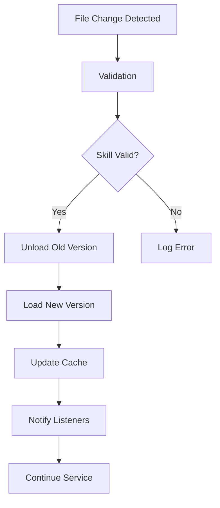

## Overview

Hot reloading allows you to update skills at runtime without restarting the FastSkill service. This feature is essential for development workflows where you need to iterate quickly on skill implementations.

<Info>
Hot reloading is primarily intended for development environments. Consider disabling it in production for better performance and security.
</Info>

## How Hot Reloading Works



## Configuration

### Enable Hot Reloading

```rust
use fastskill::{ServiceConfig, HotReloadConfig};
use std::{path::PathBuf, time::Duration};

let config = ServiceConfig {
    enable_hot_reload: true,
    watch_paths: vec![
        PathBuf::from("./skills"),           // Main skills directory
        PathBuf::from("./custom-skills"),     // Custom skills
    ],
    hot_reload_config: Some(HotReloadConfig {
        debounce: Duration::from_secs(1),     // Wait 1s after changes
        max_depth: 5,                         // Max directory depth
        ignore_patterns: vec![".git".to_string(), "*.tmp".to_string()],
        include_patterns: vec!["*.md".to_string(), "*.json".to_string()],
    }),
    ..Default::default()
};
```

### File Watching

Configure which files and directories to watch:

```rust
use fastskill::{ServiceConfig, HotReloadConfig};
use std::path::PathBuf;

// Watch specific file types
let config = ServiceConfig {
    enable_hot_reload: true,
    watch_paths: vec![PathBuf::from("./skills")],
    hot_reload_config: Some(HotReloadConfig {
        include_patterns: vec!["*.md".to_string(), "*.json".to_string()],
        ignore_patterns: vec![".git".to_string(), ".DS_Store".to_string()],
        max_depth: 5,  // Recursive watching
        ..Default::default()
    }),
    ..Default::default()
};
```

## Development Workflow

### 1. Setup Hot Reloading

```rust
use fastskill::{FastSkillService, ServiceConfig, HotReloadConfig};
use std::{path::PathBuf, time::Duration};

#[tokio::main]
async fn main() -> Result<(), Box<dyn std::error::Error>> {
    // Configure for development
    let config = ServiceConfig {
        skill_storage_path: PathBuf::from("./skills"),
        enable_hot_reload: true,
        watch_paths: vec![PathBuf::from("./skills")],
        hot_reload_config: Some(HotReloadConfig {
            debounce: Duration::from_secs(1),
            ..Default::default()
        }),
        ..Default::default()
    };

    // Initialize service
    let mut service = FastSkillService::new(config).await?;
    service.initialize().await?;

    println!("🔥 Hot reloading enabled!");
    println!("📁 Watching directories: ./skills");
    println!("📝 Edit skills and see changes automatically");

    // Keep service running
    tokio::signal::ctrl_c().await?;
    service.shutdown().await?;
    println!("\n👋 Development session ended");
    Ok(())
}
```

### 2. Create and Update Skills

```rust
use fastskill::{FastSkillService, ServiceConfig, SkillDefinition, SkillId};
use std::path::PathBuf;

// Example: Create a simple skill
#[tokio::main]
async fn main() -> Result<(), Box<dyn std::error::Error>> {
    let config = ServiceConfig {
        skill_storage_path: PathBuf::from("./skills"),
        enable_hot_reload: true,
        ..Default::default()
    };

    let mut service = FastSkillService::new(config).await?;
    service.initialize().await?;

    // Create skill definition
    let skill = SkillDefinition::new(
        SkillId::new("hello-world".to_string())?,
        "Hello World".to_string(),
        "A simple hello world skill".to_string(),
        "1.0.0".to_string(),
    );

    // Register skill
    let skill_id = service.skill_manager().register_skill(skill).await?;
    println!("✅ Skill registered: {}", skill_id);

    // Create SKILL.md file in skills/hello-world/SKILL.md
    // When you edit it, hot reloading will detect the change

    service.shutdown().await?;
    Ok(())
}
```

### 3. Live Updates

```markdown
# Edit the skill file and see changes immediately
# skills/hello-world/SKILL.md - updated version

---
name: hello-world
description: A simple hello world skill with enhanced features
---

# Hello World

This skill greets users with enthusiasm!

## Tools

### say_hello

Say hello with enthusiasm!

**Parameters:**
- `name` (string, optional): Name to greet (default: "World")

**Returns:**
- Greeting message

### say_goodbye

Say goodbye to someone.

**Parameters:**
- `name` (string, optional): Name to say goodbye to (default: "World")

**Returns:**
- Goodbye message
```

The skill is automatically reloaded when you save the file!
New tools and updated functionality are available immediately.

## Event Handling

Subscribe to hot reload events:

```rust
use fastskill::{FastSkillService, ServiceConfig};
use std::path::PathBuf;

// Hot reload events are logged automatically when files change
// Check service logs to see reload events
#[tokio::main]
async fn main() -> Result<(), Box<dyn std::error::Error>> {
    let config = ServiceConfig {
        skill_storage_path: PathBuf::from("./skills"),
        enable_hot_reload: true,
        ..Default::default()
    };

    let mut service = FastSkillService::new(config).await?;
    service.initialize().await?;

    println!("🔥 Hot reloading enabled - watch logs for reload events");
    println!("📝 Edit skill files to see automatic reloading");

    // Keep service running
    tokio::signal::ctrl_c().await?;
    service.shutdown().await?;
    Ok(())
}
```

## Monitoring Hot Reloading

### Performance Metrics

```bash
# Monitor hot reload through service logs
# Enable debug logging to see detailed reload information
RUST_LOG=fastskill=debug fastskill serve --enable-hot-reload

# Check logs for reload events:
# - File change detection
# - Skill reload timing
# - Validation results
# - Error messages
```

### Debug Mode

Enable debug mode for detailed hot reload information:

```bash
# Enable debug logging for hot reload
export FASTSKILL_LOG_LEVEL=DEBUG
fastskill serve --hot-reload --debug

# Monitor file changes in real-time
fastskill serve --hot-reload --watch-verbose
```

## Production Considerations

### Disable in Production

```rust
use fastskill::ServiceConfig;
use std::path::PathBuf;

// Production configuration - hot reload disabled
let config = ServiceConfig {
    skill_storage_path: PathBuf::from("./skills"),
    enable_hot_reload: false,  // Disable for security and performance
    ..Default::default()
};
```

### Conditional Reloading

Enable hot reloading only for specific skills or environments:

```rust
use fastskill::{ServiceConfig, HotReloadConfig};
use std::path::PathBuf;

// Conditional reloading configuration
let config = ServiceConfig {
    skill_storage_path: PathBuf::from("./skills"),
    enable_hot_reload: true,
    hot_reload_config: Some(HotReloadConfig {
        // Configure reload behavior
        debounce: Duration::from_secs(1),
        max_depth: 5,
        ..Default::default()
    }),
    ..Default::default()
};
```

## File Change Detection

### Supported File Types

Hot reloading monitors these file types by default:

| Extension | Purpose | Reload Trigger |
|-----------|---------|----------------|
| `.md` | Skill definitions (SKILL.md) | Skill metadata or tool definitions |
| `.json` | Skill definitions | Metadata or configuration changes |
| `.yaml` | Configuration files | Settings or parameter changes |
| `.md` | Documentation | Help text or description updates |

### Change Detection Rules

```rust
use fastskill::{ServiceConfig, HotReloadConfig};
use std::path::PathBuf;
use std::time::Duration;

// Configure change detection
let config = ServiceConfig {
    enable_hot_reload: true,
    hot_reload_config: Some(HotReloadConfig {
        debounce: Duration::from_secs(1),  // Wait 1s after changes
        max_depth: 5,                       // Max directory depth to watch
        ignore_patterns: vec![".git".to_string(), "*.tmp".to_string()],
        include_patterns: vec!["*.md".to_string(), "*.json".to_string()],
    }),
    ..Default::default()
};
```

## Integration with Development Tools

### IDE Integration

### IDE Integration

Hot reloading works automatically with any editor. When you save a skill file:

1. FastSkill detects the file change
2. Validates the skill definition
3. Reloads the skill if valid
4. Logs the reload event

Monitor reload events through service logs or by checking the service status.

### Live Testing

```bash
# Use file watchers to run tests when skills change
# Example with entr (Linux/Mac)
find ./skills -name "*.md" | entr -c cargo test

# Or use a simple watch script
while inotifywait -e modify ./skills/**/*.md; do
    cargo test
done
```

## Troubleshooting

<AccordionGroup>
<Accordion title="Hot Reload Not Working">
  <Warning>
  **Check configuration**: Ensure hot reload is enabled and watch paths are correct.
  ```bash
  # Verify configuration
  fastskill serve --enable-hot-reload --watch-paths ./skills
  ```
  </Warning>

  <Warning>
  **File permissions**: Ensure FastSkill has read permissions for watched directories.
  ```bash
  # Fix permissions
  chmod 755 ./skills/
  chmod 644 ./skills/**/*.md
  ```
  </Warning>
</Accordion>

<Accordion title="Reload Too Slow">
  <Tip>
  **Optimize watch paths**: Limit the number of directories and files being watched.
  ```rust
  let config = ServiceConfig {
      watch_paths: vec![PathBuf::from("./skills")],  // Single directory
      hot_reload_config: Some(HotReloadConfig {
          include_patterns: vec!["*.md".to_string(), "*.json".to_string()],  // Only essential files
          ..Default::default()
      }),
      ..Default::default()
  };
  ```
  </Tip>

  <Tip>
  **Increase debounce time**: Add delay to batch multiple file changes.
  ```rust
  let config = ServiceConfig {
      hot_reload_config: Some(HotReloadConfig {
          debounce: Duration::from_secs(2),  // 2 second debounce
          ..Default::default()
      }),
      ..Default::default()
  };
  ```
  </Tip>
</Accordion>

<Accordion title="Validation Errors on Reload">
  <Info>
  **Check file syntax**: Ensure updated files have valid syntax before saving.
  ```bash
  # Validate Python files
  python -m py_compile skills/skill.py

  # Validate JSON files
  python -c "import json; json.load(open('skill.json'))"
  ```
  </Info>

  <Info>
  **Review error logs**: Check service logs for detailed validation error information.
  ```bash
  fastskill logs --level DEBUG --follow
  ```
  </Info>
</Accordion>
</AccordionGroup>

## Best Practices

<Steps>
<Step title="Use development-only skills">
  Create separate skills for development with "dev-" prefix to avoid affecting production.
</Step>

<Step title="Test thoroughly">
  Run comprehensive tests after hot reload to ensure functionality still works.
</Step>

<Step title="Monitor performance">
  Keep an eye on reload times and memory usage during development.
</Step>

<Step title="Version control integration">
  Ensure hot reload changes are properly tracked in version control.
</Step>

<Step title="Disable in production">
  Always disable hot reload in production environments for security and performance.
</Step>
</Steps>

<Note>
Hot reloading dramatically improves development experience by eliminating the need to restart services. Use it during development but disable it in production environments.
</Note>
