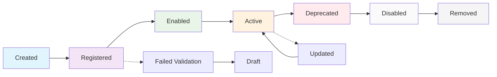

## Overview

The skill lifecycle encompasses all stages of a skill's existence in FastSkill, from initial creation through updates and eventual retirement. Understanding lifecycle management is crucial for maintaining a healthy skill ecosystem.

<Info>
Proper lifecycle management ensures skills remain relevant, secure, and performant throughout their lifetime.
</Info>

## Skill Lifecycle Stages



### 1. Created
Skills are initially created as definition files or programmatically.

### 2. Registered
Skills are registered with FastSkill and become part of the system.

### 3. Enabled
Registered skills are enabled and available for discovery and execution.

### 4. Active
Enabled skills are actively used by AI agents and frameworks.

### 5. Updated
Active skills receive updates through version releases.

### 6. Deprecated
Skills that are being phased out but still functional are marked as deprecated.

### 7. Disabled
Deprecated skills are disabled but remain in the system for reference.

### 8. Removed
Skills are completely removed from the system.

## Creating Skills

### From Scratch

<Steps>
<Step title="Define skill requirements">
Start by understanding what the skill should do:
- **Purpose**: What problem does it solve?
- **Capabilities**: What specific functions does it provide?
- **Interface**: How do agents interact with it?
- **Constraints**: What are the limitations and requirements?
</Step>

<Step title="Create skill definition">
```json skill.json
{
  "id": "document-converter",
  "name": "Document Format Converter",
  "description": "Convert documents between different formats including PDF, DOCX, HTML, and plain text",
  "version": "1.0.0",
  "author": "Your Organization",
  "tags": "documents,conversion,formats,pdf,docx,html",
  "capabilities": "format_conversion,document_processing,pdf_to_text,docx_to_html",
  "skill_file": "document-converter/converter.py",
  "enabled": true,
  "execution_timeout": 60,
  "memory_limit_mb": 512,
  "dependencies": ["pypdf2", "python-docx", "beautifulsoup4"],
  "metadata": {
    "category": "document-processing",
    "supported_inputs": ["pdf", "docx", "html", "txt"],
    "supported_outputs": ["pdf", "docx", "html", "txt", "json"],
    "max_file_size_mb": 50
  }
}
```
</Step>

<Step title="Create SKILL.md file">
Create a SKILL.md file following the Claude Code standard:

```markdown skills/document-converter/SKILL.md
---
name: document-converter
description: Convert documents between different formats including PDF, DOCX, HTML, and plain text
---

# Document Format Converter

This skill converts documents between different formats.

## Tools

### convert_document

Converts a document to a different format.

**Parameters:**
- `input_file` (string, required): Path to input document
- `output_format` (string, required): Desired output format (pdf, docx, html, txt, json)

**Returns:**
- Path to converted document
</Step>

<Step title="Register and test">
```rust
use fastskill::{FastSkillService, ServiceConfig, SkillDefinition, SkillId};
use std::path::PathBuf;

#[tokio::main]
async fn main() -> Result<(), Box<dyn std::error::Error>> {
    let config = ServiceConfig {
        skill_storage_path: PathBuf::from("./skills"),
        ..Default::default()
    };

    let mut service = FastSkillService::new(config).await?;
    service.initialize().await?;

    // Create skill definition
    let skill = SkillDefinition::new(
        SkillId::new("document-converter".to_string())?,
        "Document Format Converter".to_string(),
        "Convert documents between different formats including PDF, DOCX, HTML, and plain text".to_string(),
        "1.0.0".to_string(),
    );

    // Register skill
    let skill_id = service.skill_manager().register_skill(skill).await?;
    println!("✅ Skill created: {}", skill_id);

    // Test discovery
    let skills = service.metadata_service()
        .discover_skills("convert document")
        .await?;
    println!("🔍 Found {} matching skills", skills.len());

    // Test capability search
    let converter_skills = service.metadata_service()
        .find_skills_by_capability("format_conversion")
        .await?;
    println!("🛠️  Found {} skills with format conversion", converter_skills.len());

    service.shutdown().await?;
    Ok(())
}
```
</Step>
</Steps>

## Version Management

### Semantic Versioning

FastSkill uses semantic versioning (MAJOR.MINOR.PATCH):

- **MAJOR**: Breaking changes that affect compatibility
- **MINOR**: New features that are backward compatible
- **PATCH**: Bug fixes and small improvements

### Version Updates

<Steps>
<Step title="Plan the update">
Determine what type of update you're making:
- **Patch**: Bug fixes, security updates, performance improvements
- **Minor**: New features, additional capabilities, extended API
- **Major**: Breaking changes, API redesign, dependency changes
</Step>

<Step title="Update version number">
```rust
use fastskill::{FastSkillService, ServiceConfig, SkillId, SkillUpdate};
use std::path::PathBuf;

#[tokio::main]
async fn main() -> Result<(), Box<dyn std::error::Error>> {
    let config = ServiceConfig {
        skill_storage_path: PathBuf::from("./skills"),
        ..Default::default()
    };

    let mut service = FastSkillService::new(config).await?;
    service.initialize().await?;

    let skill_id = SkillId::new("document-converter".to_string())?;

    // For a minor feature update
    let updates = SkillUpdate {
        version: Some("1.1.0".to_string()),  // Minor version bump
        description: Some("Enhanced document converter with OCR support".to_string()),
        capabilities: Some(vec![
            "format_conversion".to_string(),
            "document_processing".to_string(),
            "pdf_to_text".to_string(),
            "docx_to_html".to_string(),
            "ocr_support".to_string(),
        ]),
        ..Default::default()
    };

    service.skill_manager()
        .update_skill(&skill_id, updates)
        .await?;

    println!("✅ Skill updated to version 1.1.0");

    service.shutdown().await?;
    Ok(())
}
```
</Step>

<Step title="Update SKILL.md">
Modify the skill's SKILL.md file to document the new version and capabilities.
</Step>

<Step title="Test compatibility">
Ensure backward compatibility or clearly document breaking changes in the skill documentation.
</Step>
</Steps>

## Skill Updates

### Partial Updates

Update specific fields without replacing the entire skill definition:

```python
# Update only specific fields
update_data = {
    "version": "1.0.1",
    "execution_timeout": 45,  # Increase timeout for larger files
    "metadata": {
        "max_file_size_mb": 100  # Increase file size limit
    }
}

success = await service.update_skill("document-converter", update_data)
```

### Full Updates

Replace the entire skill definition:

```python
# Complete skill replacement
new_skill_definition = {
    "id": "document-converter",
    "name": "Advanced Document Converter",
    "description": "Professional document conversion with AI-powered features",
    "version": "2.0.0",  # Major version bump
    "capabilities": "format_conversion,ai_enhancement,layout_preservation",
    # ... all other fields
}

await service.update_skill("document-converter", new_skill_definition)
```

## Enable/Disable Management

### Enabling Skills

<Steps>
<Step title="Enable a skill">
```python
# Enable a disabled skill
await service.enable_skill("document-converter")
print("✅ Skill enabled")

# Verify it's available
skills = await service.list_skills()
enabled_skills = [s for s in skills if s['enabled']]
print(f"📋 {len(enabled_skills)} skills enabled")
```
</Step>

<Step title="Batch enable skills">
```python
# Enable multiple skills
skill_ids = ["skill-1", "skill-2", "skill-3"]
for skill_id in skill_ids:
    await service.enable_skill(skill_id)
    print(f"✅ Enabled: {skill_id}")
```
</Step>
</Steps>

### Disabling Skills

<Steps>
<Step title="Disable a skill">
```python
# Disable a skill (soft delete)
await service.disable_skill("old-skill")
print("✅ Skill disabled")

# Verify it's not available for discovery
skills = await service.discover_skills("old functionality")
print(f"🔍 Found {len(skills)} matching skills")  # Should be 0
```
</Step>

<Step title="Batch disable skills">
```python
# Disable multiple skills
deprecated_skills = ["legacy-skill-1", "legacy-skill-2"]
for skill_id in deprecated_skills:
    await service.disable_skill(skill_id)
    print(f"⏸️  Disabled: {skill_id}")
```
</Step>
</Steps>

## Deprecation Process

### Marking as Deprecated

<Steps>
<Step title="Update skill status">
```python
# Mark skill as deprecated
deprecated_skill = {
    "id": "legacy-converter",
    "deprecated": True,
    "deprecation_notice": "This skill is deprecated. Use 'document-converter' instead.",
    "removal_date": "2024-12-31",  # When it will be removed
    "replacement_skill": "document-converter"
}

await service.update_skill("legacy-converter", deprecated_skill)
```
</Step>

<Step title="Notify users">
```python
# Get all deprecated skills
all_skills = await service.list_skills()
deprecated_skills = [s for s in all_skills if s.get('deprecated', False)]

for skill in deprecated_skills:
    print(f"⚠️  DEPRECATED: {skill['name']}")
    print(f"   Notice: {skill.get('deprecation_notice', 'No notice')}")
    if 'replacement_skill' in skill:
        print(f"   Use instead: {skill['replacement_skill']}")
```
</Step>
</Steps>

## Skill Removal

### Complete Removal

<Warning>
Skill removal is permanent and cannot be undone. Always disable skills first and give users time to migrate.
</Warning>

<Steps>
<Step title="Pre-removal checklist">
- [ ] Skill is disabled
- [ ] Users have been notified of removal
- [ ] Migration path to replacement skills is documented
- [ ] All dependencies have been identified and handled
- [ ] Backup of skill definition and data is created
</Step>

<Step title="Remove the skill">
```python
# Remove skill completely
await service.remove_skill("legacy-skill")
print("🗑️  Skill removed permanently")

# Verify removal
all_skills = await service.list_skills()
remaining_ids = [s['id'] for s in all_skills]
assert "legacy-skill" not in remaining_ids
print("✅ Skill removal verified")
```
</Step>

<Step title="Clean up resources">
```python
# Clean up associated files and cache
await service.cleanup_skill_resources("legacy-skill")

# Clear any cached data
await service.clear_skill_cache("legacy-skill")
```
</Step>
</Steps>

### Safe Removal Process

```python
async def safe_skill_removal(skill_id: str, replacement_id: str = None):
    """Safely remove a skill with proper migration path."""

    service = FastSkillService()
    await service.initialize()

    # 1. Get skill information
    skill = await service.get_skill(skill_id)
    if not skill:
        print(f"❌ Skill {skill_id} not found")
        return

    # 2. Disable the skill
    await service.disable_skill(skill_id)
    print(f"⏸️  Disabled skill: {skill_id}")

    # 3. Update with deprecation notice
    deprecated_update = {
        "deprecated": True,
        "deprecation_notice": f"Removed in favor of {replacement_id or 'newer alternatives'}",
        "removal_date": "2024-12-31"
    }
    if replacement_id:
        deprecated_update["replacement_skill"] = replacement_id

    await service.update_skill(skill_id, deprecated_update)
    print(f"⚠️  Marked as deprecated: {skill_id}")

    # 4. Wait for migration period (in real scenario)
    print(f"📅 Migration period: 30 days")
    print(f"   Users should migrate to: {replacement_id or 'newer alternatives'}")

    # 5. Remove after migration period
    await service.remove_skill(skill_id)
    print(f"🗑️  Permanently removed: {skill_id}")

    await service.shutdown()
```

## Lifecycle Monitoring

### Track Skill Usage

```python
async def monitor_skill_lifecycle():
    service = FastSkillService()
    await service.initialize()

    # Get lifecycle statistics
    all_skills = await service.list_skills()

    stats = {
        "total": len(all_skills),
        "enabled": len([s for s in all_skills if s.get('enabled', True)]),
        "disabled": len([s for s in all_skills if not s.get('enabled', True)]),
        "deprecated": len([s for s in all_skills if s.get('deprecated', False)])
    }

    print("📊 Skill Lifecycle Statistics:")
    print(f"   Total skills: {stats['total']}")
    print(f"   Enabled: {stats['enabled']}")
    print(f"   Disabled: {stats['disabled']}")
    print(f"   Deprecated: {stats['deprecated']}")

    # Show deprecated skills requiring attention
    deprecated_skills = [s for s in all_skills if s.get('deprecated', False)]
    if deprecated_skills:
        print(f"\n⚠️  Deprecated skills:")
        for skill in deprecated_skills:
            print(f"   - {skill['name']} (ID: {skill['id']})")
            if 'removal_date' in skill:
                print(f"     Removal date: {skill['removal_date']}")

    await service.shutdown()
```

### Version History

```python
# Track version changes
async def track_version_history(skill_id: str):
    """Track version changes for a skill."""

    # In a real implementation, this would come from version history
    version_history = [
        {"version": "1.0.0", "date": "2024-01-15", "changes": "Initial release"},
        {"version": "1.0.1", "date": "2024-02-01", "changes": "Bug fixes"},
        {"version": "1.1.0", "date": "2024-03-15", "changes": "Added OCR support"},
        {"version": "2.0.0", "date": "2024-06-01", "changes": "Major rewrite with AI features"}
    ]

    print(f"📈 Version history for {skill_id}:")
    for entry in version_history:
        print(f"   {entry['version']} ({entry['date']}): {entry['changes']}")
```

## Best Practices

<Steps>
<Step title="Plan for the full lifecycle">
  Consider the entire lifecycle when designing skills, from creation to eventual removal.
</Step>

<Step title="Use semantic versioning">
  Follow semantic versioning conventions to clearly communicate the impact of changes.
</Step>

<Step title="Provide migration paths">
  When deprecating or removing skills, always provide clear migration paths to replacement skills.
</Step>

<Step title="Monitor skill health">
  Regularly review skill usage, performance, and relevance to identify candidates for updates or removal.
</Step>

<Step title="Document lifecycle decisions">
  Maintain documentation of why skills were deprecated or removed for future reference.
</Step>
</Steps>

<Warning>
Always disable skills before removing them. This gives users time to migrate and prevents sudden service disruptions.
</Warning>
