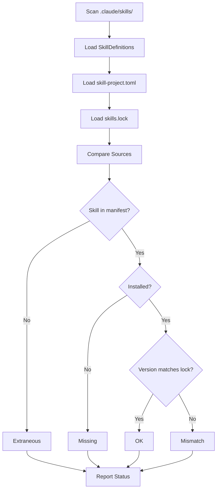

## Overview

The FastSkill reconciliation system compares three sources of truth to ensure consistency across your skill ecosystem:

1. **Installed Skills** - Skills actually present in `.claude/skills/`
2. **Project Manifest** - Skills declared in `skill-project.toml`
3. **Lockfile** - Exact versions pinned in `skills.lock`

Reconciliation helps you identify discrepancies and maintain reproducible installations across environments.

## Reconciliation States

When you run `fastskill list`, each skill is assigned a reconciliation status:

| Status | Description | Action Required |
|---------|-------------|-----------------|
| `ok` | Skill is installed and matches project/lock files | None |
| `missing` | Skill is in `skill-project.toml` but not installed | Run `fastskill install` |
| `extraneous` | Skill is installed but not in `skill-project.toml` | Remove or add to manifest |
| `mismatch` | Installed version differs from `skills.lock` | Run `fastskill install --lock` or `fastskill update` |

### Status Details

#### OK

Skill is in the desired state:
- Present in `.claude/skills/`
- Declared in `skill-project.toml` (if applicable)
- Version matches `skills.lock` (if lockfile exists)

**Example:**
```bash
$ fastskill list
ID               Version  Source              Status
──────────────────────────────────────────────────────────────
web-scraper      1.2.3    git                  ok
data-processor    2.1.0    registry              ok
```

#### Missing

Skill is declared in `skill-project.toml` but not installed:

```bash
$ fastskill list
ID               Version  Source              Status
──────────────────────────────────────────────────────────────
web-scraper      1.2.3    git                  missing
data-processor    2.1.0    registry              ok
```

**Resolution:**
```bash
# Install missing skills
fastskill install
```

#### Extraneous

Skill is installed but not declared in `skill-project.toml`:

```bash
$ fastskill list
ID               Version  Source              Status
──────────────────────────────────────────────────────────────
web-scraper      1.2.3    git                  ok
data-processor    2.1.0    registry              ok
old-skill        0.1.0    local                extraneous
```

**Resolution options:**
```bash
# Option 1: Remove extraneous skill
fastskill remove old-skill

# Option 2: Add to skill-project.toml
# Edit skill-project.toml and add:
# [dependencies]
# old-skill = { source = "local", path = "./old-skill" }
```

#### Mismatch

Installed version differs from `skills.lock`:

```bash
$ fastskill list
ID               Version  Source              Status
──────────────────────────────────────────────────────────────
web-scraper      1.2.3    git                  ok
data-processor    2.2.0    registry              mismatch (lock: 2.1.0)
```

<Warning>
Version mismatches indicate manual changes or corruption. Resolve to ensure reproducibility.
</Warning>

**Resolution:**
```bash
# Option 1: Reinstall from lockfile (reproducible)
fastskill install --lock

# Option 2: Update to latest and update lock
fastskill update
```

## Reconciliation Process

The `list` command performs reconciliation in this order:



## Use Cases

### Development Workflow

```bash
# 1. Add skills to manifest
# Edit skill-project.toml:
# [dependencies]
# new-skill = { source = "git", url = "https://github.com/user/new-skill.git" }

# 2. Install skills
fastskill install

# 3. Check reconciliation
fastskill list
# Output: new-skill shows as "ok"

# 4. Install with lock for reproducibility
fastskill install --lock
```

### Team Collaboration

```bash
# Team member A: Add skill and install
fastskill add https://github.com/user/new-skill.git
git add skill-project.toml skills.lock
git commit -m "Add new-skill"

# Team member B: Pull and verify
git pull
fastskill list
# Output: All skills should be "ok"

# Team member B: Install with lock
fastskill install --lock
```

### CI/CD Deployment

```bash
# CI/CD: Verify installation
fastskill list --format json > skills-status.json

# Check for reconciliation issues
if jq '.[] | select(.status != "ok")' skills-status.json; then
  echo "Reconciliation issues found"
  exit 1
fi

# Install from lock for reproducibility
fastskill install --lock
```

### Troubleshooting Discrepancies

```bash
# 1. Identify issues
fastskill list

# 2. Install missing skills
fastskill install

# 3. Remove extraneous skills
fastskill remove old-skill

# 4. Fix version mismatches
fastskill install --lock

# 5. Verify all are ok
fastskill list
```

## Lockfile-Based Reconciliation

When using `skills.lock`, reconciliation focuses on exact version matching:

### Production Deployment

```bash
# Deploy with locked versions
fastskill install --lock

# Verify reconciliation
fastskill list
# All skills should be "ok"
```

### Version Drift Detection

```bash
# Check for version drift
fastskill list

# If mismatch found:
# data-processor    2.2.0    registry              mismatch (lock: 2.1.0)

# Resolution depends on intent:
# - If intentional update: update lockfile
# - If accidental corruption: reinstall from lock
```

## Reconciliation JSON Format

The `list --format json` output includes detailed reconciliation status:

```json
[
  {
    "id": "web-scraper",
    "version": "1.2.3",
    "description": "Web scraping utilities",
    "source": "git",
    "installed_path": "/home/user/.claude/skills/web-scraper",
    "installed_at": "2026-02-02T12:00:00Z",
    "status": "ok",
    "manifest_version": "1.2.3",
    "lock_version": "1.2.3"
  },
  {
    "id": "data-processor",
    "version": "2.2.0",
    "description": "Data processing tools",
    "source": "registry",
    "installed_path": "/home/user/.claude/skills/data-processor",
    "installed_at": "2026-02-01T10:00:00Z",
    "status": "mismatch",
    "manifest_version": "2.1.0",
    "lock_version": "2.1.0"
  }
]
```

**Field Descriptions:**
- `id`: Skill identifier
- `version`: Installed version (from SkillDefinition)
- `description`: Skill description
- `source`: Source type (git, registry, local, zip)
- `installed_path`: Absolute path to skill directory
- `installed_at`: Installation timestamp (ISO 8601)
- `status`: Reconciliation status (ok, missing, extraneous, mismatch)
- `manifest_version`: Version from `skill-project.toml` (if present)
- `lock_version`: Version from `skills.lock` (if present)

## Reconciliation with Groups

When using dependency groups, reconciliation considers group membership:

```toml skill-project.toml
[dependencies]
prod-skill = { source = "git", url = "https://github.com/user/prod-skill.git", groups = ["prod"] }
dev-tool = { source = "local", path = "./dev-tool", groups = ["dev"] }
```

```bash
# Install production skills only
fastskill install --without dev

# Check reconciliation
fastskill list

# Output:
# prod-skill: ok
# dev-tool: missing (expected, excluded by --without dev)
```

<Info>
Missing status is expected for skills excluded by group filters. Only report as issues if all skills should be installed.
</Info>

## Best Practices

<Steps>
<Step title="Commit both manifest and lockfile">
  Always commit `skill-project.toml` and `skills.lock` together to version control. This ensures team members can reproduce exact installations.
</Step>

<Step title="Run fastskill list after changes">
  Run `fastskill list` after installing, updating, or removing skills to verify reconciliation status.
</Step>

<Step title="Use --lock for production">
  Always use `fastskill install --lock` for production deployments to ensure exact version reproducibility.
</Step>

<Step title="Investigate mismatches promptly">
  Version mismatches indicate manual changes or corruption. Investigate and resolve promptly to maintain consistency.
</Step>

<Step title="Remove extraneous skills">
  Remove or add extraneous skills to `skill-project.toml` to avoid confusion and ensure clean skill ecosystem.
</Step>
</Steps>

## Common Reconciliation Issues

### Scenario: Manual Skill Installation

```bash
# Manual: Add skill outside fastskill
cp -r /path/to/skill ~/.claude/skills/manual-skill

# Check reconciliation
fastskill list

# Output:
# manual-skill: extraneous (not in manifest)

# Resolution: Add to manifest or remove
```

### Scenario: Version Mismatch After Update

```bash
# Update skill manually
cd ~/.claude/skills/web-scraper
git pull origin main

# Check reconciliation
fastskill list

# Output:
# web-scraper: mismatch (lock: 1.2.3, installed: 1.3.0)

# Resolution: Update lockfile or reinstall from lock
fastskill install --lock
```

### Scenario: Missing Skills After Clone

```bash
# Clone repository without skills.lock
git clone repo
cd repo

# Check reconciliation
fastskill list

# Output:
# web-scraper: missing (skills.lock not found)

# Resolution: Install skills
fastskill install
```

## Reconciliation in Automation

### CI/CD Health Check

```yaml
# .github/workflows/health-check.yml
name: Skill Health Check
on: [push, pull_request]

jobs:
  check-reconciliation:
    runs-on: ubuntu-latest
    steps:
      - uses: actions/checkout@v3

      - name: Install FastSkill
        run: |
          cargo install fastskill --features git-support

      - name: Check reconciliation status
        run: |
          fastskill list --format json > skills-status.json

      - name: Verify no reconciliation issues
        run: |
          issues=$(jq '[.[] | select(.status != "ok")] | length' skills-status.json)
          if [ "$issues" -gt 0 ]; then
            echo "Found $issues reconciliation issues:"
            jq '[.[] | select(.status != "ok")]' skills-status.json
            exit 1
          fi
          echo "All skills reconciled successfully"
```

### Automated Reconciliation Report

```bash
#!/bin/bash
# reconcile.sh - Generate reconciliation report

echo "=== FastSkill Reconciliation Report ==="
echo "Generated: $(date)"
echo ""

# Get reconciliation status
fastskill list --format json > /tmp/skills-status.json

# Count by status
ok_count=$(jq '[.[] | select(.status == "ok")] | length' /tmp/skills-status.json)
missing_count=$(jq '[.[] | select(.status == "missing")] | length' /tmp/skills-status.json)
extraneous_count=$(jq '[.[] | select(.status == "extraneous")] | length' /tmp/skills-status.json)
mismatch_count=$(jq '[.[] | select(.status == "mismatch")] | length' /tmp/skills-status.json)

echo "Summary:"
echo "  OK: $ok_count"
echo "  Missing: $missing_count"
echo "  Extraneous: $extraneous_count"
echo "  Mismatch: $mismatch_count"
echo ""

# Show details if issues exist
if [ $((missing_count + extraneous_count + mismatch_count)) -gt 0 ]; then
  echo "Issues Found:"
  jq '[.[] | select(.status != "ok") | .id + ": " + .status]' /tmp/skills-status.json
  exit 1
fi

echo "✓ All skills reconciled"
exit 0
```

## Troubleshooting

<AccordionGroup>
<Accordion title="All skills show as missing">
  <Warning>
  **Skills directory incorrect**: Check that `skills_directory` in `.fastskill/config.yaml` points to correct location.
  </Warning>

  <Warning>
  **skill-project.toml missing**: Create `skill-project.toml` or use `fastskill init`.
  </Warning>

  <Tip>
  **Resolution**: Run `fastskill install` to install skills from manifest.
  </Tip>
</Accordion>

<Accordion title="Extraneous skills accumulate">
  <Info>
  **Manual installations**: Skills may have been added outside FastSkill management.
  </Info>

  <Tip>
  **Resolution**: Add to `skill-project.toml` if intentional, or remove with `fastskill remove`.
  </Tip>

  <Tip>
  **Prevention**: Always use `fastskill add` to install skills for proper tracking.
  </Tip>
</Accordion>

<Accordion title="Persistent version mismatches">
  <Warning>
  **Manual file changes**: Skills may have been updated manually (e.g., git pull).
  </Warning>

  <Warning>
  **Corrupted lockfile**: Lockfile may be out of sync with actual state.
  </Warning>

  <Tip>
  **Resolution**: Run `fastskill install --lock` to reinstall from lockfile, or `fastskill update` to update lockfile.
  </Tip>
</Accordion>
</AccordionGroup>

## See Also

- [Install Command](/cli-reference/install-command) - Install skills from manifest
- [Update Command](/cli-reference/update-command) - Update skills and lockfile
- [List Command](/cli-reference/skill-commands#list) - List skills with reconciliation status
- [Manifest System](/skill-management/manifest-system) - Understanding skill-project.toml and skills.lock
- [Service Configuration](/configuration/service-config) - Configuration file reference
